# Python GUI - Tkinter

## İçindekiler

- [1. Tanım](#1-tanım)
- [2. Widgets](#2-widgets)
- [3. Uygulama: Hisse Senedi Görüntüleyici (Stock Viewer)](#3-uygulama-hisse-senedi-görüntüleyici-stock-viewer)
- [4. Tkinter Uygulamasını exe Dosyasına Dönüştürme](#4-tkinter-uygulamasını-exe-dosyasına-dönüştürme)

# 1. Tanım

---

**Python GUI**, Python programlama dilini kullanarak Grafiksel Kullanıcı Arayüzleri (Graphical User Interfaces - GUI) oluşturmak için kullanılan bir yaklaşımdır. GUI'lar, kullanıcıların programlarıyla etkileşimde bulunmalarını sağlayan bir grafiksel arayüz sağlar. Bu tür arayüzler, kullanıcıların butonları tıklamaları, metin girişi yapmaları, seçenekleri seçmeleri ve diğer etkileşimlerde bulunmaları için farklı bileşenler içerebilir.

**Tkinter** ise Python programlama dilinde GUI uygulamaları oluşturmak için kullanılan bir kütüphanedir.

# 2. Widgets

---

Tkinter ile oluşturulan arayüz bileşenlerine **widget** (bileşen) denilir. Bu widget'lar, kullanıcı etkileşimine olanak sağlamak, veri göstermek veya kullanıcıya bilgi girişi yapmasını sağlamak gibi çeşitli işlevlere sahip olabilir.

Kullanacağımız kütüphaneleri import edelim.

```python
import tkinter as tk
from tkinter import ttk
```

`tk` modülü, Tkinter'ın temel modülüdür ve Tk GUI toolkit'ini Python programlama diline bağlar. Bu modül, Tkinter ile ilgili temel işlevleri ve bileşenleri sağlar. Örneğin, Tk sınıfı, Tkinter uygulamalarında kullanılan ana pencereyi temsil eder. `ttk` modülü (Themed Tkinter), Tkinter'ın üzerine inşa edilen bir modüldür. Tkinter'ın temel modülüne ek olarak, ttk modülü daha gelişmiş ve özelleştirilebilir GUI bileşenlerini sağlar.

### 2.1. Window

Window veya pencere bileşeni, bir kullanıcı arayüzü penceresini ifade eder. Tkinter ile bir pencere oluşturabilir ve bu pencere üzerinde butonlar, metin alanları, etiketler, listeler gibi farklı bileşenleri yerleştirebiliriz. Bu pencere, kullanıcının programımızla etkileşimde bulunmasını sağlar. Pencere genellikle bir uygulamanın ana penceresi olarak kullanılır ve diğer bileşenleri içinde barındırır.

Bir grafiksel kullanıcı arayüzü (GUI) penceresi oluşturmakla başlayalım.

```python
pencere = tk.Tk()
```

Burada, `tk.Tk()` ifadesi, Tkinter kütüphanesinin `Tk` sınıfından bir nesne oluşturulmasını sağlar. Bu nesne, bir GUI penceresini temsil eder. Oluşturulan pencere, kullanıcıya arayüz elemanlarını (butonlar, metin kutuları, etiketler vb.) göstermek ve kullanıcı etkileşimine yanıt vermek için kullanılabilir.

Tkinter penceresinin boyutunu ayarlayalım.

```python
pencere.geometry("600x450")
```

Yukarıda, pencerenin genişliğini 600 piksel, yüksekliğini ise 450 piksel olarak belirledik.

Tkinter penceresinin başlık metnini ayarlayalım.

```python
pencere.title("Uygulama Hoş geldiniz!")
```

Yukarıda, pencerenin başlık metnini "Uygulamaya Hoş Geldiniz!" olarak belirledik.

Pencereyi görebilmek için aşağıdaki kodu çalıştırmamız gerekiyor.

```python
pencere.mainloop()
```

Son kodumuzda Tkinter penceresinin ana döngüsünü başlattık. Bu yöntem, pencerenin görünür kalmasını sağlar ve kullanıcı etkileşimini bekler. `pencere.mainloop()` her zaman en aşağıda kalmalıdır. Yani, bundan sonra yazacağımız kodlar bu satırdan önce olmalıdır.

Kodun tamamını görelim.

```python
import tkinter as tk
from tkinter import ttk

pencere = tk.Tk()
pencere.geometry("600x450")
pencere.title("Uygulama Hoş geldiniz!")

pencere.mainloop()
```

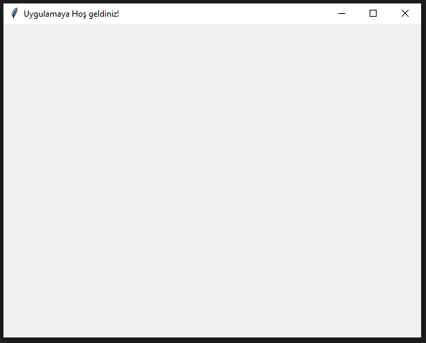

### 2.2. Button

Button veya buton bileşeni, kullanıcının bir eylemi tetiklemesini sağlar.

Uygulamamıza buton eklemeyi görelim.

```python
buton = tk.Button(
    pencere,
    text="Ben Bir Butonum",
    bg="orange",
    fg="black",
    activebackground="red",
    activeforeground="white",
    font=24,
    height=5,
    width=20,
    cursor="hand2",
    command= butonFonksiyonu
)
```

Neler yaptığımıza bakalım.

`pencere`, butonun ekleneceği yerdir. `text`, butonun üzerinde görünecek metindir. Bu metin, "Ben Bir Butonum" olarak ayarlandı. `bg`, butonun arka plan rengidir. Bu renk, "orange" (turuncu) olarak belirlendi. `fg`, butonun metin rengidir. Bu renk, "black" (siyah) olarak belirlendi. `activebackground`, butona tıklanıldığında dönüşecek olan arka plan rengidir. Bu renk, "red" (kırmızı) olarak belirlendi. `activeforeground`, butona tıklanıldığında değişecek olan metin rengidir. Bu renk, "white" (beyaz) olarak belirlendi. `font`, butonun metin fontudur. Yazı büyüklüğü 24 punto olarak belirlendi. `height`, butonun yüksekliğidir. Bu yükseklik, 5 piksel olarak ayarlandı. `width`, butonun genişliğidir. Bu genişlik 20 piksel olarak ayarlandı. `cursor`, butonun üzerine gelindiğinde imlecin nasıl değişeceğidir. Bu değişiklik pointer olarak ayarlandı. `command`, buton tıklandığında çalışacak olan fonksiyondur. Bu fonksiyonun ismi "butonFonksiyonu"dur.

Bu şekilde bıraktığımızda öncelikle ismini verdiğimiz fonksiyondan dolayı çalışmayacaktır. Bu fonksiyonu butondan önce tanımlayalım ve butona bastıkça konsola belirlediğimiz yazıyı yazdıralım.

```python
def butonFonksiyonu():
    print("Butona tıkladın...")

button = tk.Button(
    window,
    text="Ben Bir Butonum",
    bg="orange",
    fg="black",
    activebackground="red",
    activeforeground="white",
    font=24,
    height=5,
    width=20,
    cursor="hand2",
    command= butonFonksiyonu
)
```

Bu şekilde ise pencerede butonu göremeyeceğiz. Çünkü son bir satır kaldı. Onu da yazalım.

```python
def butonFonksiyonu():
    print("Butona tıkladın...")

button = tk.Button(
    window,
    text="Ben Bir Butonum",
    bg="orange",
    fg="black",
    activebackground="red",
    activeforeground="white",
    font=24,
    height=5,
    width=20,
    cursor="hand2",
    command= butonFonksiyonu
)

button.pack()
```

Son satıra, bir bileşeni (örneğin, bir butonu) pencere üzerinde yerleştirmek için kullanılan bir metodu ekledik. Bu metot, bileşenlerin sıralı bir şekilde pencereye yerleştirilmesini sağlar.

Kodun tamamını görelim.

```python
import tkinter as tk
from tkinter import ttk

pencere = tk.Tk()
pencere.geometry("600x450")
pencere.title("Uygulama Hoş Geldiniz!")

def butonFonksiyonu():
    print("Butona tıkladın...")

buton = tk.Button(
    pencere,
    text="Ben Bir Butonum",
    bg="orange",
    fg="black",
    activebackground="red",
    activeforeground="white",
    font=24,
    height=5,
    width=20,
    cursor="hand2",
    command= butonFonksiyonu
)

buton.pack()

pencere.mainloop()
```

Pencere ilk açıldığında aşağıdaki görüntüyü elde edeceğiz.

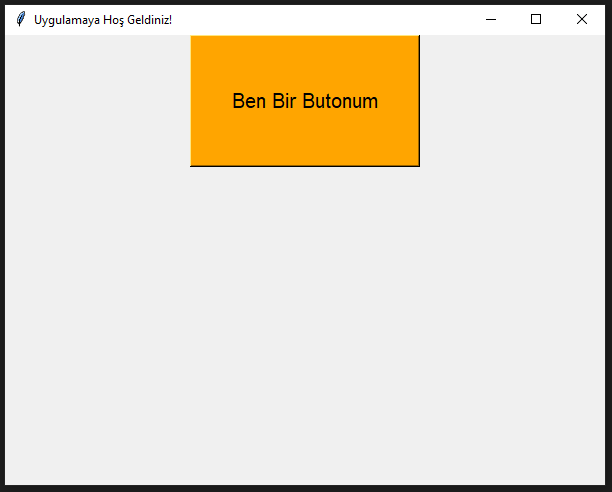

Tıklayınca butonun arka plan ve metin rengi aşağıdaki gibi olacaktır.

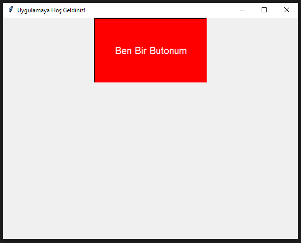

Butona üç defa tıkladım. Çıktıları VS Code'da aşağıdaki gibi aldım.

```
Butona tıkladın...
Butona tıkladın...
Butona tıkladın...
```

### 2.3. Label

Label veya etiket bileşeni, statik metin veya resimleri göstermek için kullanılır. Kullanıcı etkileşimi gerektirmez, sadece bilgi veya açıklama amaçlı kulllanılır.

Uygulamamıza etiket eklemeyi görelim ve butonun altına bir etiket ekleyelim.

```python
etiket = tk.Label(
    pencere,
    text="Ben Bir Etiketim",
    font="Tahoma 24",
    bg="blue",
    fg="white",
    wraplength=150
)
```

Neler yaptığımıza bakalım.

`pencere`, butonun ekleneceği yerdir. `text`, etiketin üzerinde görünecek metni belirtir. `font`, metnin kullanacağı yazı tipini ve boyutunu belirtir. `bg`, etiketin arka plan rengini belirtir. `fg`, etiketin metin rengini belirtir. `wraplength`, etiketin kaç piksel genişliğinde bir hizada sarma yapması gerektiğini belirtir.

Ancak bu şekilde çalışmayacaktır. Yine butonda olduğu gibi aşağıdaki satırı eklememiz gerekiyor.

```python
etiket = tk.Label(
    pencere,
    text="Ben Bir Etiketim",
    font="Tahoma 24",
    bg="blue",
    fg="white",
    wraplength=150
)

etiket.pack()
```

Kodun tamamını görelim.

```python
import tkinter as tk
from tkinter import ttk

pencere = tk.Tk()
pencere.geometry("600x450")
pencere.title("Uygulama Hoş Geldiniz!")

def butonFonksiyonu():
    print("Butona tıkladın...")

buton = tk.Button(
    pencere,
    text="Ben Bir Butonum",
    bg="orange",
    fg="black",
    activebackground="red",
    activeforeground="white",
    font=24,
    height=5,
    width=20,
    cursor="hand2",
    command= butonFonksiyonu
)

buton.pack()

etiket = tk.Label(
    pencere,
    text="Ben Bir Etiketim",
    font="Tahoma 24",
    bg="blue",
    fg="white",
    wraplength=150
)

etiket.pack()

pencere.mainloop()
```

Pencerenin son hali aşağıdaki gibi olacaktır.

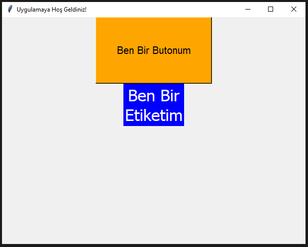

Label'ı biraz aşağıya alalım. Bu işlemi `etiket.pack()` içinde `pady` parametresi ile yapacağız. Yani, bu satırı aşağıdaki gibi güncelleyebiliriz.

```python
etiket.pack(pady=10)
```

Çıktının son hali aşağıdaki gibi olacaktır.

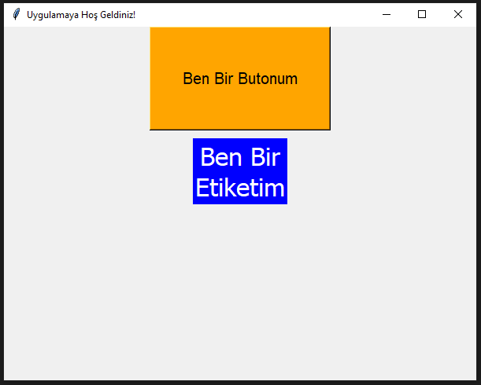

Butona tıkladığımızda etiketin değişmesini istediğimizi varsayalım. Bunun için oluşturduğumuz `butonFonksiyonu` isimli fonksiyonu güncelleyeceğiz.

```python
def butonFonksiyonu():
    # print("Butona tıkladın...")

    etiket.config(
        text="Değiştim",
        bg="red",
        font="Verdana"
    )
```

Burada kullandığımız `etiket.config()` metodu bir etiket bileşeninin konfigürasyon ayarlarını değiştirmek için kullanılır. Bu metot, etiket bileşeninin farklı özelliklerini (metin, yazı tipi, arka plan rengi, vb.) güncellemek için kullanılabilir. Biz ise metni "Değiştim", arka plan rengini "red" ile kırmızı ve font'u "Verdana" ile değiştirdik.

Son bir kez kodun tamamını görelim ve son değişiklikleri alalım.

```python
import tkinter as tk
from tkinter import ttk

pencere = tk.Tk()
pencere.geometry("600x450")
pencere.title("Uygulama Hoş Geldiniz!")

def butonFonksiyonu():
    # print("Butona tıkladın...")

    etiket.config(
        text="Değiştim",
        bg="red",
        font="Verdana"
    )

buton = tk.Button(
    pencere,
    text="Ben Bir Butonum",
    bg="orange",
    fg="black",
    activebackground="red",
    activeforeground="white",
    font=24,
    height=5,
    width=20,
    cursor="hand2",
    command= butonFonksiyonu
)

buton.pack()

etiket = tk.Label(
    pencere,
    text="Ben Bir Etiketim",
    font="Tahoma 24",
    bg="blue",
    fg="white",
    wraplength=150
)

etiket.pack(pady=10)

pencere.mainloop()
```

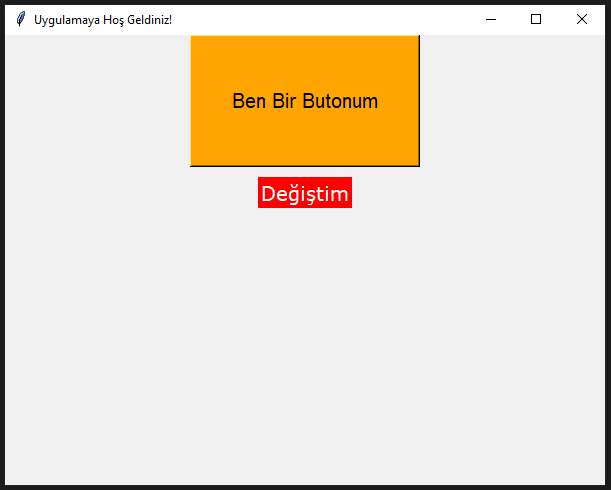

### 2.4. Entry

Entry veya giriş bileşeni, kullanıcının metin veya veri girmesine olanak sağlar.

Uygulamamıza entry eklemeyi görelim.

```python
giris = tk.Entry(
    pencere,
    width=50
)
```

Neler yaptığımıza bakalım.

`pencere`, oluşturulan giriş bileşeninin ekleneceği yerdir. `width`, giriş kutusunun genişliğidir.

Buraya bir placeholder (yer tutucu) ekleyelim. Placeholder, genellikle bir metin giriş kutusunda görünen ve kullanıcıya hangi tür bilgileri girmesi gerektiğini belirten bir metindir.

```python
entry.insert(
    string="Kafanıza göre bir şeyler yazın...",
    index=0
)
```

Placeholder'ı eklemiş olduk. `string` ile kullanıcıyı yönlendiriyoruz. `index`'in ise 0 olması, metni giriş bileşeninin başlangıcına eklemektir.

Bileşenin pencerede görülmesi için aşağıdaki satırı ekliyoruz.

```python
giris.pack()
```

Kodun tamamını görelim.

```python
import tkinter as tk
from tkinter import ttk

pencere = tk.Tk()
pencere.geometry("600x450")
pencere.title("Uygulama Hoş Geldiniz!")

def butonFonksiyonu():
    # print("Butona tıkladın...")

    etiket.config(
        text="Değiştim",
        bg="red",
        font="Verdana"
    )

buton = tk.Button(
    pencere,
    text="Ben Bir Butonum",
    bg="orange",
    fg="black",
    activebackground="red",
    activeforeground="white",
    font=24,
    height=5,
    width=20,
    cursor="hand2",
    command= butonFonksiyonu
)

buton.pack()

etiket = tk.Label(
    pencere,
    text="Ben Bir Etiketim",
    font="Tahoma 24",
    bg="blue",
    fg="white",
    wraplength=150
)

etiket.pack(pady=10)

giris = tk.Entry(
    pencere,
    width=50
)

giris.insert(
    string="Kafanıza göre bir şeyler yazın...",
    index=0
)

giris.pack()

pencere.mainloop()
```

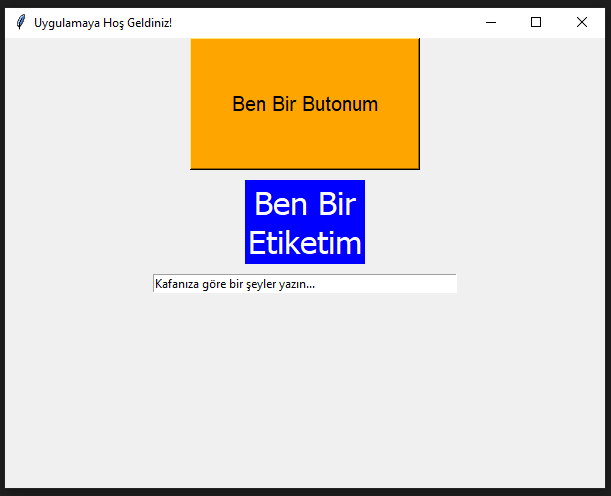

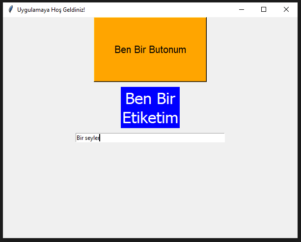

Bir şeyler yazalım ve bu yazdığımız metni, butona bastıktan sonra bir üstte yer alan etikete gönderelim.

```python
def butonFonksiyonu():
    # print("Butona tıkladın...")

    etiket.config(
        text="Nasılsın?",
        bg="red",
        font="Verdana"
    )

    yazdigin_sey = giris.get()
    etiket.config(text=yazdigin_sey)
```

`giris.get()` ile girilen değeri aldık ve bunu `etiket.config` ile `text`'e atadık. Butona bastığımızda etikete göndermesi gerekiyor.

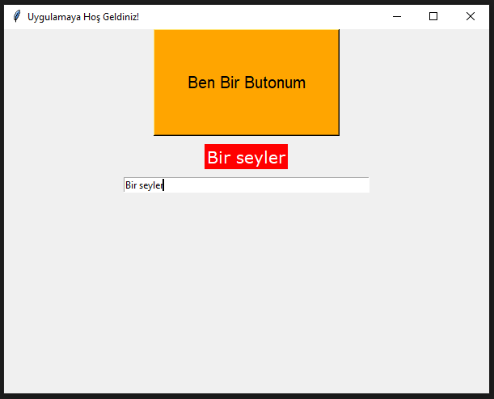

Bazen kullanıcının metin girişi yapmasını engellemek veya mevcut metni değiştirmesini engellemek isteyebiliriz. Bu durumda, bileşenin durumunu "disabled" olarak ayarlayabiliriz.

```python
def butonFonksiyonu():
    # print("Butona tıkladın...")

    etiket.config(
        text="Nasılsın?",
        bg="red",
        font="Verdana"
    )

    yazdigin_sey = giris.get()
    etiket.config(text=yazdigin_sey)
    giris.config(state="disabled")
```

Son bir kez kodun tamamını görelim.

```python
import tkinter as tk
from tkinter import ttk

pencere = tk.Tk()
pencere.geometry("600x450")
pencere.title("Uygulama Hoş Geldiniz!")

def butonFonksiyonu():
    # print("Butona tıkladın...")

    etiket.config(
        text="Nasılsın?",
        bg="red",
        font="Verdana"
    )

    yazdigin_sey = giris.get()
    etiket.config(text=yazdigin_sey)
    giris.config(state="disabled")

buton = tk.Button(
    pencere,
    text="Ben Bir Butonum",
    bg="orange",
    fg="black",
    activebackground="red",
    activeforeground="white",
    font=24,
    height=5,
    width=20,
    cursor="hand2",
    command= butonFonksiyonu
)

buton.pack()

etiket = tk.Label(
    pencere,
    text="Ben Bir Etiketim",
    font="Tahoma 24",
    bg="blue",
    fg="white",
    wraplength=150
)

etiket.pack(pady=10)

giris = tk.Entry(
    pencere,
    width=50
)

giris.insert(
    string="Kafanıza göre bir şeyler yazın...",
    index=0
)

giris.pack()

pencere.mainloop()
```

Butona tıkladıktan sonraki hali aşağıdaki gibidir.

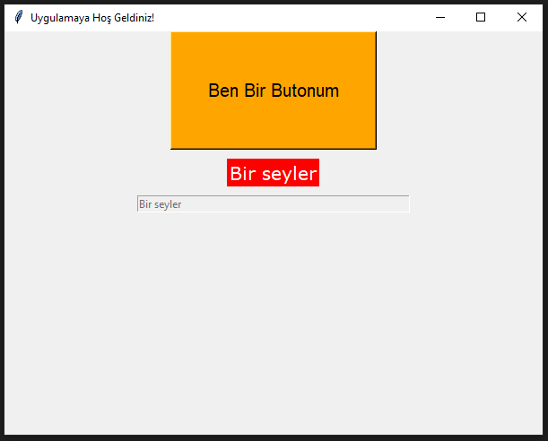

### 2.5. Message Box

Message box veya mesaj kutusu bileşeni, kullanıcıya bir mesaj, uyarı veya soru göstermek için kullanılır.

Uygulamamıza mesaj kutusu eklemeyi görelim. Bunun için bir modül import etmemiz gerekiyor.

```python
from tkinter import messagebox
```

Mesaj kutusunu fonksiyonun içerisine yazacağız ve butona tıkladığımızda bir mesaj alacağız. Örnek olarak bir info gönderelim.

```python
def butonFonksiyonu():
    # print("Butona tıkladın...")

    label.config(
        text="Nasılsın?",
        bg="red",
        font="Verdana"
    )

    yazdigin_sey = entry.get()
    label.config(
        text=yazdigin_sey
    )
    entry.config(state="disabled")

    mesaj = messagebox.showinfo(
        title="Bilgi",
        message="Butona tıkladın."
    )
    print(mesaj)
```

Mesaj kutusu, bir başlık (`title`) ve bir mesaj (`message`) içeriyor. Mesajın ne döndürdüğünü ise ekrana bastık. Dönen mesajın `ok` olduğunu göreceğiz.

Kodun tamamını görelim.

```python
import tkinter as tk
from tkinter import ttk
from tkinter import messagebox

pencere = tk.Tk()
pencere.geometry("600x450")
pencere.title("Uygulama Hoş Geldiniz!")

def butonFonksiyonu():
    # print("Butona tıkladın...")

    etiket.config(
        text="Nasılsın?",
        bg="red",
        font="Verdana"
    )

    yazdigin_sey = giris.get()
    etiket.config(text=yazdigin_sey)
    giris.config(state="disabled")

    mesaj = messagebox.showinfo(
        title="Bilgi",
        message="Butona tıkladın."
    )
    print(mesaj)

buton = tk.Button(
    pencere,
    text="Ben Bir Butonum",
    bg="orange",
    fg="black",
    activebackground="red",
    activeforeground="white",
    font=24,
    height=5,
    width=20,
    cursor="hand2",
    command= butonFonksiyonu
)

buton.pack()

etiket = tk.Label(
    pencere,
    text="Ben Bir Etiketim",
    font="Tahoma 24",
    bg="blue",
    fg="white",
    wraplength=150
)

etiket.pack(pady=10)

giris = tk.Entry(
    pencere,
    width=50
)

giris.insert(
    string="Kafanıza göre bir şeyler yazın...",
    index=0
)

giris.pack()

pencere.mainloop()
```

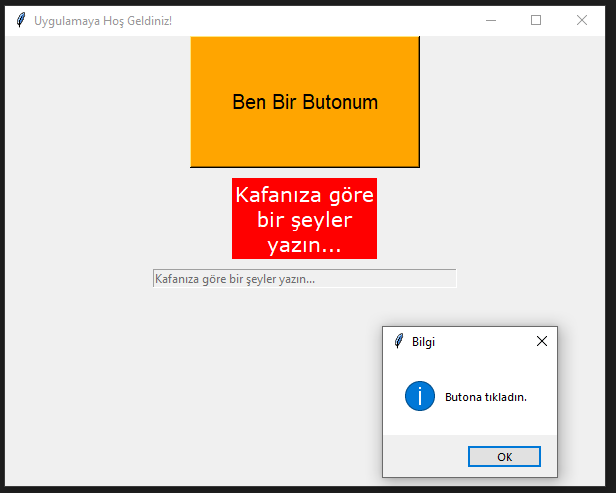

### 2.6. Geometry Manager

Bileşenlerin nerelere yerleştirileceği ve konumlandırılacağı üzerine neredeyse (sadece `pack()` kullanıldı) bir şey yapmadık.

Geometry manager veya yerleşim düzenleyici bileşeni, bileşenlerin yerleştirilmesini ve konumlandırılmasını kontrol eden bir araçtır. Bu yönetim mekanizmaları, bileşenlerin penceredeki veya bir konteyner içindeki pozisyonlarını ve boyutlarını ayarlamak için kullanılır.

Tkinter'da üç farklı yerleşim düzenleyici vardır:

* Pack Manager: Bu yönetim mekanizması, bileşenleri dikey veya yatay olarak paketleyerek yerleştirir. Bileşenler, eklenme sırasına göre otomatik olarak sıralanır ve mevcut boş alana göre genişletilir.

* Grid Manager: Bu yönetim mekanizması, bileşenleri bir ızgara düzeni şeklinde yerleştirir. Bileşenler, satır ve sütun indeksleri kullanılarak belirli hücrelere yerleştirilir. Bu yönetim mekanizması, bileşenlerin esnek bir şekilde yerleştirilmesini ve hücre boyutlarının ayarlanmasını sağlar.

* Place Manager: Bu yönetim mekanizması, bileşenleri doğrudan belirli bir konuma yerleştirir. Bileşenlerin koordinatları (x, y) cinsinden belirlenir. Bu yönetim mekanizması, daha hassas yerleştirme ve hizalama gerektiren durumlar için kullanılabilir.

Üçünü de inceleyelim. Bunun için koda sıfırdan başlayacağız.

```python
import tkinter as tk
from tkinter import ttk

window = tk.Tk()
window.title("Geometry Manager")
window.geometry("600x450")

window.mainloop()
```

#### 2.6.1. Pack Manager

Pencerenin sol tarafına bir tane buton ekleyelim.

```python
import tkinter as tk
from tkinter import ttk

pencere = tk.Tk()
pencere.geometry("600x450")
pencere.title("Uygulamaya Hoş Geldiniz!")

buton_sol_1 = tk.Button(pencere, text="Buton1", fg="red")
buton_sol_1.pack(side=tk.LEFT)

pencere.mainloop()
```

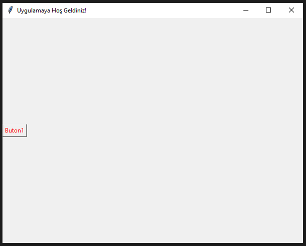

Butonu sol tarafa `side` parametresine `tk.LEFT`'i eşitleyerek koyduk. Eğer aynı şekilde bir tane daha buton eklersek nereye geleceğine bakalım.

```python
import tkinter as tk
from tkinter import ttk

pencere = tk.Tk()
pencere.geometry("600x450")
pencere.title("Uygulamaya Hoş Geldiniz!")

buton_sol_1 = tk.Button(pencere, text="Buton1", fg="red")
buton_sol_1.pack(side=tk.LEFT)

buton_sol_2 = tk.Button(pencere, text="Buton2", fg="red")
buton_sol_2.pack(side=tk.LEFT)

pencere.mainloop()
```

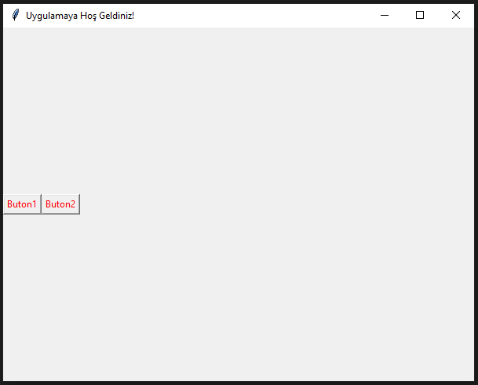

Görüldüğü üzere ilk butonun sağ tarafına geldi.

Pencerenin üst tarafına bir tane buton ekleyelim.

```python
import tkinter as tk
from tkinter import ttk

pencere = tk.Tk()
pencere.geometry("600x450")
pencere.title("Uygulamaya Hoş Geldiniz!")

buton_sol_1 = tk.Button(pencere, text="Buton1", fg="red")
buton_sol_1.pack(side=tk.LEFT)

buton_sol_2 = tk.Button(pencere, text="Buton2", fg="red")
buton_sol_2.pack(side=tk.LEFT)

buton_ust_1 = tk.Button(pencere, text="Buton3", fg="red")
buton_ust_1.pack(side=tk.TOP)

pencere.mainloop()
```

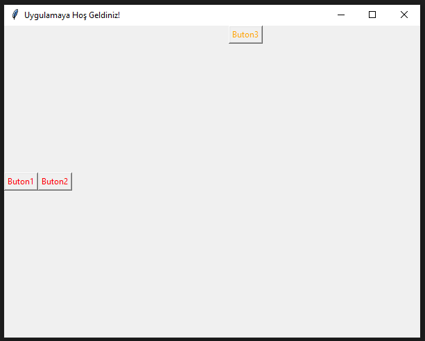

Butonu üst tarafa `side` parametresine `tk.TOP`'ı eşitleyerek koyduk. Eğer aynı şekilde bir tane daha buton eklersek nereye geleceğine bakalım.

```python
import tkinter as tk
from tkinter import ttk

pencere = tk.Tk()
pencere.geometry("600x450")
pencere.title("Uygulamaya Hoş Geldiniz!")

buton_sol_1 = tk.Button(pencere, text="Buton1", fg="red")
buton_sol_1.pack(side=tk.LEFT)

buton_sol_2 = tk.Button(pencere, text="Buton2", fg="red")
buton_sol_2.pack(side=tk.LEFT)

buton_ust_1 = tk.Button(pencere, text="Buton3", fg="orange")
buton_ust_1.pack(side=tk.TOP)

buton_ust_2 = tk.Button(pencere, text="Buton4", fg="orange")
buton_ust_2.pack(side=tk.TOP)

pencere.mainloop()
```

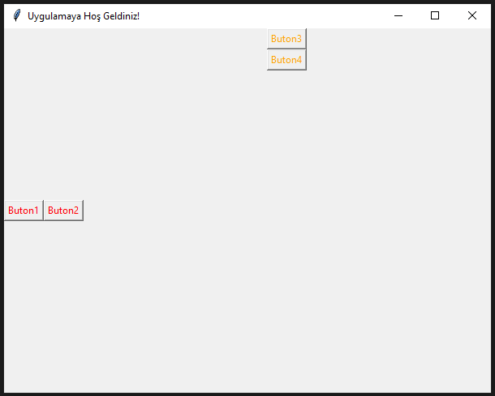

Görüldüğü üzere ilk butonun alt tarafına geldi.

Pencerenin alt tarafına bir tane buton ekleyelim.

```python
import tkinter as tk
from tkinter import ttk

pencere = tk.Tk()
pencere.geometry("600x450")
pencere.title("Uygulamaya Hoş Geldiniz!")

buton_sol_1 = tk.Button(pencere, text="Buton1", fg="red")
buton_sol_1.pack(side=tk.LEFT)

buton_sol_2 = tk.Button(pencere, text="Buton2", fg="red")
buton_sol_2.pack(side=tk.LEFT)

buton_ust_1 = tk.Button(pencere, text="Buton3", fg="orange")
buton_ust_1.pack(side=tk.TOP)

buton_ust_2 = tk.Button(pencere, text="Buton4", fg="orange")
buton_ust_2.pack(side=tk.TOP)

btn_alt_1 = tk.Button(pencere, text="Buton5", fg="blue")
btn_alt_1.pack(side=tk.BOTTOM)

pencere.mainloop()
```

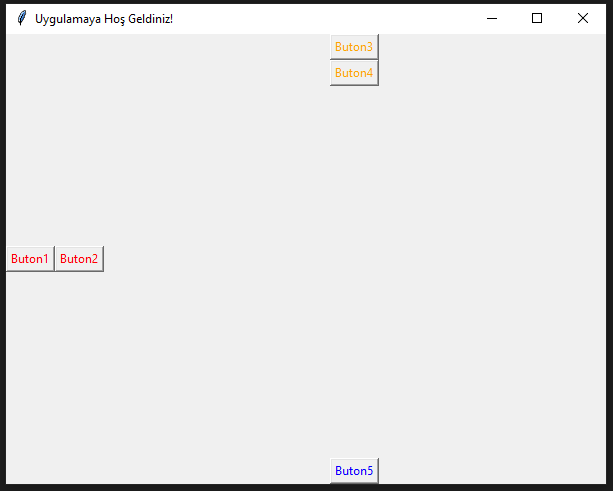

Butonu alt tarafa `side` parametresine `tk.BOTTOM`'ı eşitleyerek koyduk. Eğer aynı şekilde bir tane daha buton eklersek nereye geleceğine bakalım.

```python
import tkinter as tk
from tkinter import ttk

pencere = tk.Tk()
pencere.geometry("600x450")
pencere.title("Uygulamaya Hoş Geldiniz!")

buton_sol_1 = tk.Button(pencere, text="Buton1", fg="red")
buton_sol_1.pack(side=tk.LEFT)

buton_sol_2 = tk.Button(pencere, text="Buton2", fg="red")
buton_sol_2.pack(side=tk.LEFT)

buton_ust_1 = tk.Button(pencere, text="Buton3", fg="orange")
buton_ust_1.pack(side=tk.TOP)

buton_ust_2 = tk.Button(pencere, text="Buton4", fg="orange")
buton_ust_2.pack(side=tk.TOP)

btn_alt_1 = tk.Button(pencere, text="Buton5", fg="blue")
btn_alt_1.pack(side=tk.BOTTOM)

btn_alt_2 = tk.Button(pencere, text="Buton6", fg="blue")
btn_alt_2.pack(side=tk.BOTTOM)

pencere.mainloop()
```

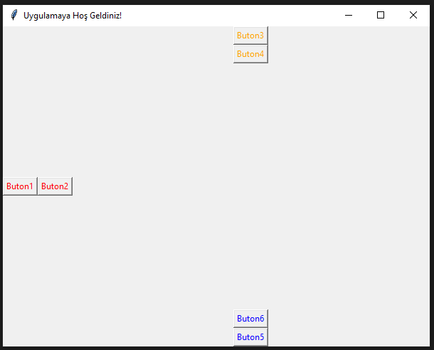

Görüldüğü üzere ilk butonun üst tarafına geldi.

`fill` parametresini `tk.BOTH`'a; `expand` parametresini `True`'ya eşitleyelim. Ne kadar uzadığını görmek için de arka plan rengini değiştirelim.

```python
import tkinter as tk
from tkinter import ttk

pencere = tk.Tk()
pencere.geometry("600x450")
pencere.title("Uygulamaya Hoş Geldiniz!")

buton_sol_1 = tk.Button(pencere, text="Buton1", fg="red")
buton_sol_1.pack(side=tk.LEFT)

buton_sol_2 = tk.Button(pencere, text="Buton2", fg="red")
buton_sol_2.pack(side=tk.LEFT)

buton_ust_1 = tk.Button(pencere, text="Buton3", fg="orange")
buton_ust_1.pack(side=tk.TOP)

buton_ust_2 = tk.Button(pencere, text="Buton4", fg="orange")
buton_ust_2.pack(side=tk.TOP)

btn_alt_1 = tk.Button(pencere, text="Buton5", fg="blue")
btn_alt_1.pack(side=tk.BOTTOM)

btn_alt_2 = tk.Button(pencere, text="Buton6", fg="blue", bg="gray")
btn_alt_2.pack(side=tk.BOTTOM, fill=tk.BOTH)

pencere.mainloop()
```

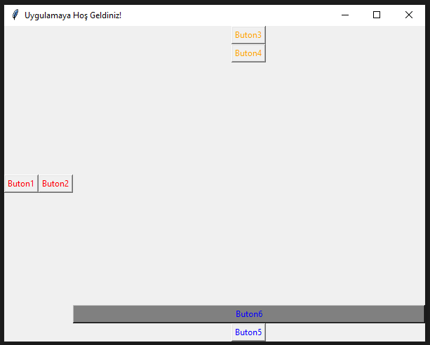

Bileşenin hem yatay hem de dikey yönde ebeveyn bileşeni içindeki tüm alanı kaplamasını sağladık. Böylece bileşen, ebeveyn bileşenin tüm alanını doldurur.

```python
import tkinter as tk
from tkinter import ttk

pencere = tk.Tk()
pencere.geometry("600x450")
pencere.title("Uygulamaya Hoş Geldiniz!")

buton_sol_1 = tk.Button(pencere, text="Buton1", fg="red")
buton_sol_1.pack(side=tk.LEFT)

buton_sol_2 = tk.Button(pencere, text="Buton2", fg="red")
buton_sol_2.pack(side=tk.LEFT)

buton_ust_1 = tk.Button(pencere, text="Buton3", fg="orange")
buton_ust_1.pack(side=tk.TOP)

buton_ust_2 = tk.Button(pencere, text="Buton4", fg="orange")
buton_ust_2.pack(side=tk.TOP)

btn_alt_1 = tk.Button(pencere, text="Buton5", fg="blue")
btn_alt_1.pack(side=tk.BOTTOM)

btn_alt_2 = tk.Button(pencere, text="Buton6", fg="blue", bg="gray")
btn_alt_2.pack(side=tk.BOTTOM, fill=tk.BOTH, expand=True)

pencere.mainloop()
```

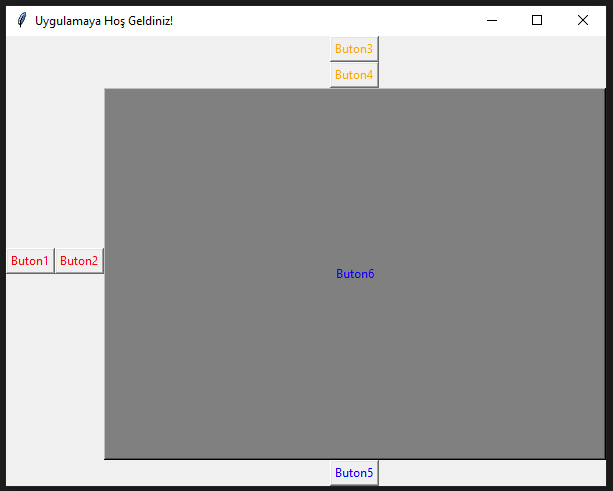

Bileşenin ebeveyn bileşeni içindeki boş alanı doldurmasını sağlar. Böylece bileşen, içindeki içeriğe uygun boyutta kalırken, boş alanı kullanarak büyüyebilir.

#### 2.6.2. Grid Manager

Grid Manager'ı anlamak için bir for döngüsü çalıştıracağız.

```python
import tkinter as tk
from tkinter import ttk

pencere = tk.Tk()
pencere.title("Uygulamaya Hoş Geldiniz!")

for satir in range(1,16):
    for sutun in range(1,11):
        etiket = tk.Label(pencere, text='Satır%s-Sütun%s'%(satir,sutun))
        etiket.grid(row=satir, column=sutun, padx=5, pady=5)

pencere.mainloop()
```

Satırda 15; sütunda 10 tane label olacak şekilde ayarladık ve bunların konumlarını yazdırdık. Grid'in yapısı aşağıdaki gibidir.

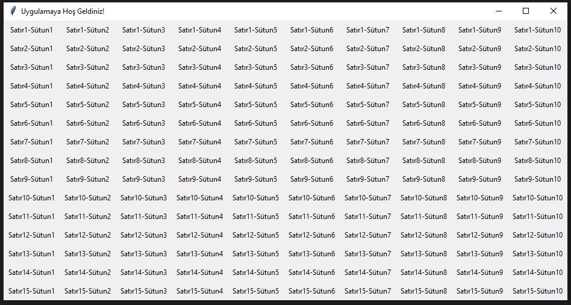

#### 2.6.3. Place Manager

Etiketi yatay ve dikey eksenden 25 piksel olacak şekilde uzaklaştıralım.

```python
import tkinter as tk
from tkinter import ttk

pencere = tk.Tk()
pencere.title("Uygulamaya Hoş Geldiniz!")

etiket1 = tk.Label(pencere, text="Etiket1")
etiket1.place(x = 25, y = 25)

pencere.mainloop()
```

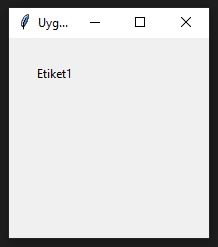

Görüldüğü üzere sol ve üst eksenden 25 piksel uzaklaştı. Bu şekilde piksel ayarlamaları ile konum belirlenebilir. Pikselin yanında oranlar ile de konumlandırma yapılabilir. Örneğin, tam ortaya almak için 0.5 değerini (%50) vermemiz yeterlidir.

```python
import tkinter as tk
from tkinter import ttk

pencere = tk.Tk()
pencere.title("Uygulamaya Hoş Geldiniz!")

etiket1 = tk.Label(pencere, text="Etiket1")
etiket1.place(x = 25, y = 25)

etiket2 = tk.Label(pencere, text="Etiket2")
etiket2.place(relx = 0.5, rely = 0.5)

pencere.mainloop()
```

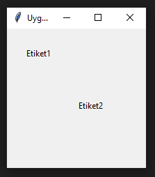

### 2.7. Radio Button

Radio button veya radyo butonu, kullanıcının bir seçenek listesinden yalnızca bir seçenek yapmasına izin verir.

Uygulamamıza radyo butonu eklemeyi görelim.

Önce bir buton ekleyeceğiz. Çünkü bir radyo butonu seçeceğiz ve öncesinde oluşturduğumuz butona tıkladığımızda hangisini seçtiğimizi göreceğiz.

```python
import tkinter as tk
from tkinter import ttk

pencere = tk.Tk()
pencere.geometry("600x450")
pencere.title("Uygulamaya Hoş Geldiniz!")

def butonFonksiyonu():
    pass

buton = tk.Button(
    pencere,
    text="Tıkla",
    bg="orange",
    fg="black",
    activebackground="red",
    activeforeground="black",
    font=24,
    height=2,
    width=10,
    cursor="hand2",
    command= butonFonksiyonu
)

buton.pack(pady=10)

pencere.mainloop()
```

Yukarıda ne yaptığımızı biliyoruz.

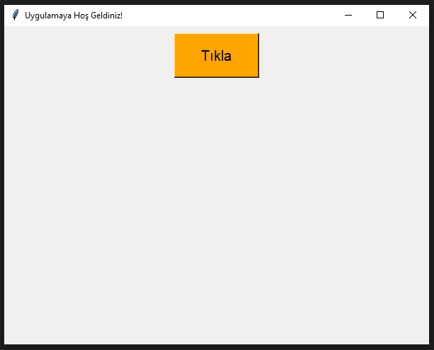

Şimdi radyo buton ekleyebiliriz. İki tane ekleyelim ve sonra ne yaptığımıza bakalım.

```python
radyo_buton = tk.StringVar()
radyo_buton.set("1")
radyo_buton1 = tk.Radiobutton(
    pencere,
    text="Radyo Buton 1",
    value="1",
    variable=radyo_buton
)
radyo_buton1.place(x=180, y=135)

radyo_buton2 = tk.Radiobutton(
    pencere,
    text="Radyo Buton 2",
    value="2",
    variable=radyo_buton
)
radyo_buton2.place(x=370, y=135)
```

İlk olarak, `tk.StringVar()` kullanarak bir `StringVar` nesnesi olan `radyo_buton`u oluşturduk. Bu nesne, radyo butonlarının seçili olan değerini depolamak için kullanılıyor. `radyo_buton` nesnesine varsayılan bir değer atamak için `radyo_buton.set("1")` kullanıyoruz. Bu durumda, "1" seçeneği başlangıçta seçili olarak ayarlanacak. `tk.Radiobutton` kullanarak ilk radyo butonu olan `radyo_buton1`'i oluşturuyoruz. Bu buton, pencere üzerinde görünecek ve metni "Radyo Buton 1" olacak. `value` parametresi "1" olarak ayarlanmıştır, bu da bu radyo butonunun değerini temsil eder. `variable` parametresi `radyo_buton` nesnesini belirtir, bu sayede radyo butonları arasında bir grup oluşturulur. `radyo_buton1` için `place()` yöntemini kullanarak konumlandırmayı yapıyoruz. x=180 ve y=135 ile belirtilen koordinatlarda radyo düğmesini yerleştiriyoruz. Aynı adımları takip ederek ikinci radyo butonu olan `radyo_buton2`'yi oluşturuyoruz. Metni "Radyo Buton 2" olarak ayarlanmış ve değeri "2" olarak belirlenmiştir. `radyo_buton2` için de `place()` yöntemini kullanarak konumlandırmayı yapıyoruz. x=370 ve y=135 ile belirtilen koordinatlarda radyo düğmesini yerleştiriyoruz.

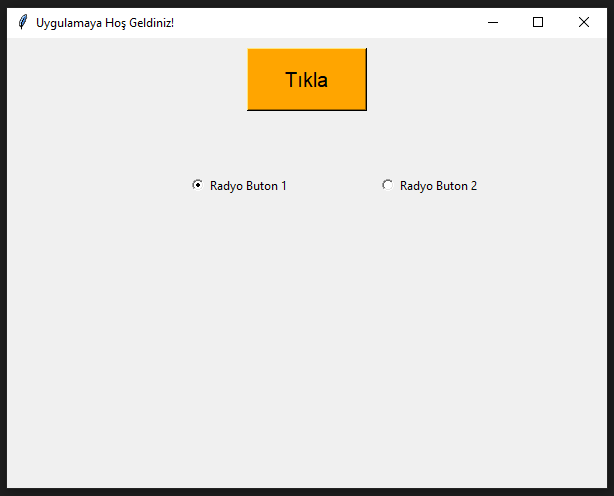

Geldik son aşamaya. Butona tıkladığımızda hangisini seçtiysek ekrana bastıralım. Buradaki ekran kod editörümüz olacak.

```python
def butonFonksiyonu():
    rb = radyo_buton.get()
    if rb == "1":
        print("Radyo Buton 1")
    elif rb == "2":
        print("Radyo Buton 2")
```

`radyo_buton` değişkenindeki değeri `rb` değişkenine atadık ve koşul bloklarını çalıştırdık. Eğer `rb` "1" ise `Radyo Buton 1`; "2" ise `Radyo Buton 2` yazdıracak.

Tüm kodu görelim.

```python
import tkinter as tk
from tkinter import ttk

pencere = tk.Tk()
pencere.geometry("600x450")
pencere.title("Uygulamaya Hoş Geldiniz!")

def butonFonksiyonu():
    rb = radyo_buton.get()
    if rb == "1":
        print("Radyo Buton 1")
    elif rb == "2":
        print("Radyo Buton 2")

buton = tk.Button(
    pencere,
    text="Tıkla",
    bg="orange",
    fg="black",
    activebackground="red",
    activeforeground="black",
    font=24,
    height=2,
    width=10,
    cursor="hand2",
    command= butonFonksiyonu
)

buton.pack(pady=10)

radyo_buton = tk.StringVar()
radyo_buton.set("1")
radyo_buton1 = tk.Radiobutton(
    pencere,
    text="Radyo Buton 1",
    value="1",
    variable=radyo_buton
)
radyo_buton1.place(x=180, y=135)

radyo_buton2 = tk.Radiobutton(
    pencere,
    text="Radyo Buton 2",
    value="2",
    variable=radyo_buton
)
radyo_buton2.place(x=370, y=135)

pencere.mainloop()
```

Butona tıkladığımızda aşağıdaki çıktıları doğru bir şekilde almayı bekleriz.

```
Radio Button 1
Radio Button 2
```

### 2.8. Combo Box

Combo box veya açılır kutu bileşeni, kullanıcıya bir dizi seçenek sunan bir açılır kutu şeklinde görünür.

Uygulamamıza açılır kutu eklemeyi görelim.

```python
import tkinter as tk
from tkinter import ttk

window = tk.Tk()
window.title("Uygulamaya Hoş geldiniz!")
window.geometry("600x450")

def butonFonksiyonu():
    pass

button = tk.Button(
    window,
    text="Tıkla",
    bg="orange",
    fg="black",
    activebackground="red",
    activeforeground="black",
    font=24,
    height=2,
    width=10,
    cursor="hand2",
    command= butonFonksiyonu
).place(relx=0.4,rely=0.1)

window.mainloop()
```

Yukarıda ne yaptığımızı biliyoruz.


Açılır kutuyu ekledikten sonra butona tıkladığımızda hangi seçeneğin seçildiğini ekrana bastıracağız.

```python
acilir_kutu = tk.StringVar()
acilir_kutu = ttk.Combobox(
    pencere,
    textvariable=acilir_kutu,
    values=("İstanbul","Ankara","İzmir"),
    state="readonly"
)
acilir_kutu.place(relx=0.4, rely=0.3)
```


Kullanıcı bu açılır kutuya tıklayarak üç şehir seçeneğinden birini seçebilir.

Yukarıda, `acilir_kutu` isminde bir `StringVar` oluşturuyoruz. Bu değişken, depolama için kullanılacak. `textvariable`, seçilen değeri depolamak için kullanılacak olan `acilir_kutu` değişkenine atar. `values`, gösterilecek seçenekleri belirtir. `state`, "readonly" olarak ayarlanması kullanıcının elle bir değer giremeyeceği, yalnızca mevcut seçenekler arasından seçim yapabileceği anlamına gelir. Konumu yine `place` ile ayarladık.

Son olarak, fonksiyonu ayarlayalım.

```python
def butonFonksiyonu():
    cb = acilir_kutu.get()

    if cb == "İstanbul":
        print("İstanbul seçildi")
    elif cb == "Ankara":
        print("Ankara seçildi")
    elif cb == "İzmir":
        print("İzmir seçildi")
```

`acilir_kutu` değişkenindeki değeri `cb` değişkenine atadık ve koşul bloklarını çalıştırdık. Eğer `cb` "Istanbul" ise `İstanbul seçildi`, "Ankara" ise `Ankara seçildi` ve "Izmir" ise `İzmir seçildi` yazdıracak.

Kodun tamamını görelim.

```python
import tkinter as tk
from tkinter import ttk

pencere = tk.Tk()
pencere.geometry("600x450")
pencere.title("Uygulamaya Hoş Geldiniz!")

def butonFonksiyonu():
    cb = acilir_kutu.get()

    if cb == "İstanbul":
        print("İstanbul seçildi")
    elif cb == "Ankara":
        print("Ankara seçildi")
    elif cb == "İzmir":
        print("İzmir seçildi")

buton = tk.Button(
    pencere,
    text="Tıkla",
    bg="orange",
    fg="black",
    activebackground="red",
    activeforeground="black",
    font=24,
    height=2,
    width=10,
    cursor="hand2",
    command= butonFonksiyonu
)
buton.place(relx=0.4,rely=0.1)

acilir_kutu = tk.StringVar()
acilir_kutu = ttk.Combobox(
    pencere,
    textvariable=acilir_kutu,
    values=("İstanbul","Ankara","İzmir"),
    state="readonly"
)
acilir_kutu.place(relx=0.4, rely=0.3)

pencere.mainloop()
```

Butona tıklayınca aşağıdaki gibi çıktıları doğru bir şekilde almayı bekleriz.

```
İstanbul seçildi
Ankara seçildi
İzmir seçildi
```

### 2.9. Check Button

Check button veya onay kutusu, kullanıcının bir seçeneği işaretleyebilmesini veya bir seçeneğin işaretini kaldırabilmesini sağlar.

Uygulamamıza onay kutusu eklemeyi görelim.

Onay kutusunu doldurduğumuzda ve butona bastığımızda ekrana yazı yazdıralım.

Önce butonu oluşturalım.

```python
import tkinter as tk
from tkinter import ttk

pencere = tk.Tk()
pencere.geometry("600x450")
pencere.title("Uygulamaya Hoş Geldiniz!")

def butonFonksiyonu():
    pass

buton = tk.Button(
    pencere,
    text="Tıkla",
    bg="orange",
    fg="black",
    activebackground="red",
    activeforeground="black",
    font=24,
    height=2,
    width=10,
    cursor="hand2",
    command= butonFonksiyonu
)
buton.place(relx=0.4,rely=0.1)

pencere.mainloop()
```

Yukarıda ne yaptığımızı biliyoruz.

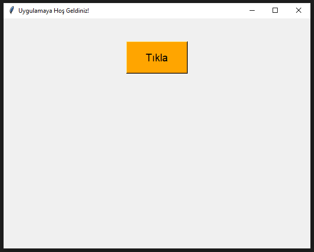

Şimdi onay kutusunu ekleyelim.

```python
def gonderFonksiyonu():
    yazilim = onay_kutusu_degisken.get()

    if yazilim == 1:
        print("Yazılım eklendi.")
    else:
        print("Yazılım eklenmedi.")

onay_kutusu_degisken = tk.IntVar()
onay_kutusu_degisken.set(0)
onay_kutusu = tk.Checkbutton(
    pencere,
    text="Yazılım departmanına da gönder",
    variable=onay_kutusu_degisken,
    activebackground="orange",
    activeforeground="black",
    command=gonderFonksiyonu
)
onay_kutusu.place(relx=0.4, rely=0.3)
```

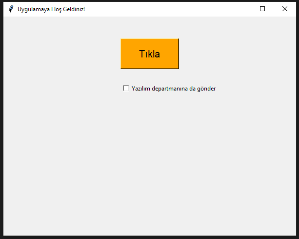

Neler yaptığımıza bakalım.

`tk.IntVar()` ile bir Tkinter değişkeni oluşturduk ve `onay_kutusu_degisken` isminde bir değişkene atadık. `set(0)` yöntemiyle, `onay_kutusu_degisken` değişkenini başlangıçta seçilmemiş olarak ayarladık. `pencere`, onay kutusunun yerleştirileceği yerdir. `text`, onay kutusunun yanında görüntülenecek metni belirtir. `variable`, onay kutusunun durumunu depolayacak değişkeni belirtir. `activebackground`, onay kutusu etkinleştirildiğinde arka plan rengini belirtir. `activeforeground`, onay kutusu etkinleştirildiğinde ön plan rengini belirtir. `command`, onay kutusuna tıklandığında çağrılacak `gonderFonksiyonu` isimli fonksiyonu tanımladık. Konumu yine `place` ile ayarladık.

Onay kutusunu işaretleyelim. Bu durumda aşağıdaki çıktıyı alacağız.

```
Yazılım eklendi.
```

Son olarak butona tıkladığımızda belirttiğimiz yazıyı ekrana basmasını sağlayalım.

```python
def butonFonksiyonu():
    print("Gönderildi.")
```

Tüm kodu görelim.

```python
import tkinter as tk
from tkinter import ttk

pencere = tk.Tk()
pencere.geometry("600x450")
pencere.title("Uygulamaya Hoş Geldiniz!")

def butonFonksiyonu():
    print("Gönderildi.")

buton = tk.Button(
    pencere,
    text="Tıkla",
    bg="orange",
    fg="black",
    activebackground="red",
    activeforeground="black",
    font=24,
    height=2,
    width=10,
    cursor="hand2",
    command= butonFonksiyonu
)
buton.place(relx=0.4,rely=0.1)

def gonderFonksiyonu():
    yazilim = onay_kutusu_degisken.get()

    if yazilim == 1:
        print("Yazılım eklendi.")
    else:
        print("Yazılım eklenmedi.")

onay_kutusu_degisken = tk.IntVar()
onay_kutusu_degisken.set(0)
onay_kutusu = tk.Checkbutton(
    pencere,
    text="Yazılım departmanına da gönder",
    variable=onay_kutusu_degisken,
    activebackground="orange",
    activeforeground="black",
    command=gonderFonksiyonu
)
onay_kutusu.place(relx=0.4, rely=0.3)

pencere.mainloop()
```

Sırasıyla işaretle, gönder, işareti kaldır, gönder yaptığımızda aşağıdaki metinleri ekrana basacağız.

```
Yazılım eklendi.
Gönderildi.
Yazılım eklenmedi.
Gönderildi.
```

### 2.10. Frames

Frame veya çerçeve, kullanıcı arayüzünü düzenlemek için kullanılan konteyner öğeleridir. Çerçeveler, diğer arayüz öğelerini (butonlar, etiketler, giriş alanları vb.) gruplandırmak ve düzenlemek için kullanılır. Bir Frame, içerisindeki öğeleri düzenlemek için bir düzene sahip olabilir ve bu şekilde kullanıcı arayüzünü daha organize bir şekilde sunabilir.

Aşağıdaki kodla başlayalım.

```python
import tkinter as tk
from tkinter import ttk

pencere = tk.Tk()
pencere.title("Uygulamaya Hoş Geldiniz!")

pencere.mainloop()
```

Çerçeveleri ekleyelim.

```python
sol_cerceve = tk.Frame(
    pencere,
    width=400,
    height=500,
    bg="gray"
)
sol_cerceve.grid(row=0, column=0)

sag_cerceve = tk.Frame(
    pencere,
    width=400,
    height=500,
    bg="orange"
)
sag_cerceve.grid(row=0, column=1)
```

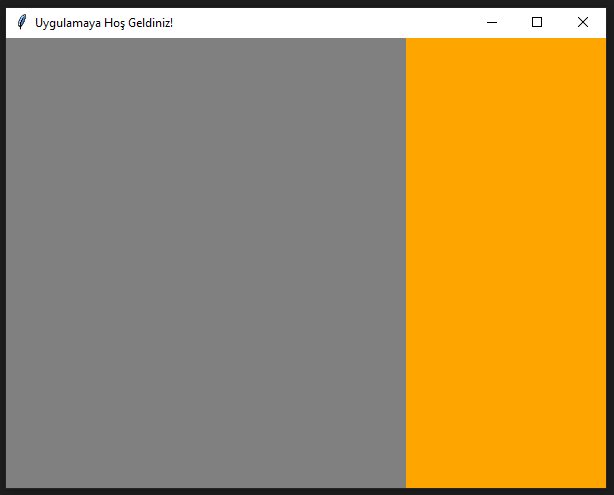

Her iki çerçeveyi de 400x500 olacak şekilde ayarladık. Farkı görmek için soldakinin rengi gri, sağdakinin rengi turuncu olarak ayarlandı. Konumlandırmayı `grid` ile yaptık.

Şimdi soldaki çerçeveyi altlı üstlü olmak üzere ikiye bölelim.

```python
sol_cerceve_1 = tk.Frame(
    sol_cerceve,
    width=400,
    height=300,
    bg="red"
)
sol_cerceve_1.grid(row=0,column=0)

sol_cerceve_2 = tk.Frame(
    sol_cerceve,
    width=400,
    height=200,
    bg="blue"
)
sol_cerceve_2.grid(row=1,column=0)
```

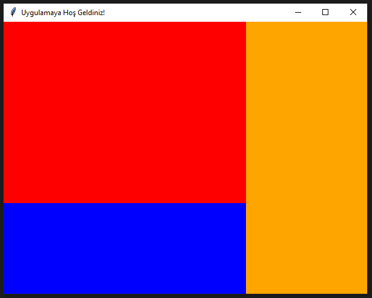

Dikkat edilirse, `tk.Frame`'den sonra artık `pencere` değil, `sol_cerceve` yazdık. Çünkü pencereye değil, soldaki çerçevenin içerisine yerleştiriyoruz. `grid` ile satır ve sütununu sırasıyla `0` ve `0` yaptığımız çerçeve üste; `1` ve `0` yaptığımız çerçeve alta konumlandırıldı. Buradaki genişlik ve yükseklik soldaki çerçevenin genişlik ve yüksekliğine göre ayarlandı. Soldaki çerçevenin genişliği olan 400 alt ve üst çerçeveler için sabit bırakıldı. Yine soldaki çerçevenin yüksekliği olan 500, üst çerçeveye 300 ve alt çerçeveye kalan 200 verildi.

Kodun tamamını görelim.

```python
import tkinter as tk
from tkinter import ttk

pencere = tk.Tk()
pencere.geometry("600x450")
pencere.title("Uygulamaya Hoş Geldiniz!")

sol_cerceve = tk.Frame(
    pencere,
    width=400,
    height=500,
    bg="gray"
)
sol_cerceve.grid(row=0, column=0)

sag_cerceve = tk.Frame(
    pencere,
    width=400,
    height=500,
    bg="orange"
)
sag_cerceve.grid(row=0, column=1)

sol_cerceve_1 = tk.Frame(
    sol_cerceve,
    width=400,
    height=300,
    bg="red"
)
sol_cerceve_1.grid(row=0,column=0)

sol_cerceve_2 = tk.Frame(
    sol_cerceve,
    width=400,
    height=200,
    bg="blue"
)
sol_cerceve_2.grid(row=1,column=0)

pencere.mainloop()
```

Son olarak, yukarıda `tk.Frame` yerine `tk.LabelFrame` de yazabiliriz. Burada ekstradan isim belirteceğiz.

```python
import tkinter as tk
from tkinter import ttk

window = tk.Tk()
window.title("Uygulamaya Hoş geldiniz!")

sol_cerceve = tk.LabelFrame(
    window,
    width=400,
    height=500,
    bg="gray",
    text="Sol Çerçeve"
)
sol_cerceve.grid(row=0, column=0)

sag_cerceve = tk.LabelFrame(
    window,
    width=400,
    height=500,
    bg="orange",
    text="Sağ Çerçeve"
)
sag_cerceve.grid(row=0, column=1)

sol_cerceve_1 = tk.LabelFrame(
    sol_cerceve,
    width=400,
    height=300,
    bg="red",
    text="Sol Çerçeve Üst"
)
sol_cerceve_1.grid(row=0,column=0)

sol_cerceve_2 = tk.LabelFrame(
    sol_cerceve,
    width=400,
    height=200,
    bg="blue",
    text="Sol Çerçeve Alt"
)
sol_cerceve_2.grid(row=1,column=0)

window.mainloop()
```

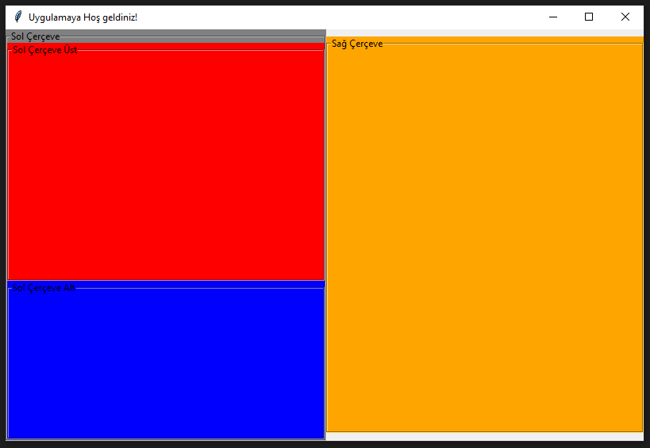

### 2.11. Paned Window

Paned window veya bölünmüş pencere, kullanıcıya bölünebilir ve yeniden boyutlandırılabilir bir pencere sunan bir bileşendir. Bölünmüş pencere, diğer bileşenleri yatay veya dikey olarak düzenlemek için kullanılabilir ve kullanıcının bu bileşenleri sürükleyerek boyutlandırmasına izin verir.

```python
import tkinter as tk
from tkinter import ttk

pencere = tk.Tk()
pencere.title("Uygulamaya Hoş Geldiniz!")

pencere.mainloop()
```

Bölünmüş pencereleri oluşturmaya başlayalım.

```python
bolunmus_pencere_h = ttk.PanedWindow(
    pencere,
    orient=tk.HORIZONTAL
)
bolunmus_pencere_h.pack(fill=tk.BOTH, expand=True)

bolunmus_pencere_v = ttk.PanedWindow(
    bolunmus_pencere_h,
    orient=tk.VERTICAL
)

cerceve_1 = ttk.Frame(
    bolunmus_pencere_h,
    width=600,
    height=200,
    relief=tk.RIDGE
)
cerceve_2 = ttk.Frame(
    bolunmus_pencere_h,
    width=600,
    height=300,
    relief=tk.RAISED
)
bolunmus_pencere_v.add(cerceve_1)
bolunmus_pencere_v.add(cerceve_2)

cerceve_3 = ttk.Frame(
    bolunmus_pencere_h,
    width=240,
    height=500,
    relief=tk.GROOVE
)
bolunmus_pencere_h.add(bolunmus_pencere_v)
bolunmus_pencere_h.add(cerceve_3)
```

Kodun tamamını görelim.

```python
import tkinter as tk
from tkinter import ttk

pencere = tk.Tk()
pencere.title("Uygulamaya Hoş Geldiniz!")

bolunmus_pencere_h = ttk.PanedWindow(
    pencere,
    orient=tk.HORIZONTAL
)
bolunmus_pencere_h.pack(fill=tk.BOTH, expand=True)

bolunmus_pencere_v = ttk.PanedWindow(
    bolunmus_pencere_h,
    orient=tk.VERTICAL
)

cerceve_1 = ttk.Frame(
    bolunmus_pencere_h,
    width=600,
    height=200,
    relief=tk.RIDGE
)
cerceve_2 = ttk.Frame(
    bolunmus_pencere_h,
    width=600,
    height=300,
    relief=tk.RAISED
)
bolunmus_pencere_v.add(cerceve_1)
bolunmus_pencere_v.add(cerceve_2)

cerceve_3 = ttk.Frame(
    bolunmus_pencere_h,
    width=240,
    height=500,
    relief=tk.GROOVE
)
bolunmus_pencere_h.add(bolunmus_pencere_v)
bolunmus_pencere_h.add(cerceve_3)

pencere.mainloop()
```

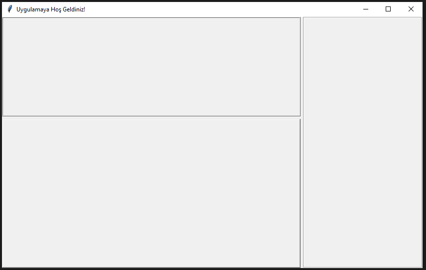

Neler yaptığımıza adım adım bakalım.

Yatay yönlü bir bölünmüş pencere oluşturuldu. Bu `bolunmus_pencere_h`, `pencere` penceresine yerleştirilir ve yatay yönlü olarak ayarlanır. `fill` ve `expand` parametreleri, `bolunmus_pencere_h`'ın pencereye tamamen sığmasını sağlar.

```python
bolunmus_pencere_h = ttk.PanedWindow(
    pencere,
    orient=tk.HORIZONTAL
)
bolunmus_pencere_h.pack(fill=tk.BOTH, expand=True)
```

Dikey yönlü bir bölünmüş pencere daha oluşturuldu. Bu `bolunmus_pencere_v`, yatay `bolunmus_pencere_h`'a yerleştirilir ve dikey yönlü olarak ayarlanır.

```python
bolunmus_pencere_v = ttk.PanedWindow(
    bolunmus_pencere_h,
    orient=tk.VERTICAL
)
```

İki adet çerçeve oluşturuldu. Her bir çerçeve, `bolunmus_pencere_h`'a yerleştirilir ve genişlik ve yükseklik değerleriyle birlikte belirtilir. Ayrıca, her bir çerçeve farklı bir kenar stiline (relief) sahiptir.

```python
cerceve_1 = ttk.Frame(
    bolunmus_pencere_h,
    width=600,
    height=200,
    relief=tk.RIDGE
)
cerceve_2 = ttk.Frame(
    bolunmus_pencere_h,
    width=600,
    height=300,
    relief=tk.RAISED
)
```

Oluşturulan çerçeveler, dikey `bolunmus_pencere_v`'ye eklendi.

```python
bolunmus_pencere_v.add(cerceve_1)
bolunmus_pencere_v.add(cerceve_2)
```

Son olarak, üçüncü bir çerçeve oluşturuldu ve yatay `bolunmus_pencere_h`'a eklendi.

```python
cerceve_3 = ttk.Frame(
    bolunmus_pencere_h,
    width=240,
    height=500,
    relief=tk.GROOVE
)
bolunmus_pencere_h.add(bolunmus_pencere_v)
bolunmus_pencere_h.add(cerceve_3)
```

### 2.12. Menu

Menu veya menü bileşeni, bir pencerenin veya uygulamanın üst kısmında yer alan bir dizi seçeneği içeren bir araç çubuğu olarak düşünülebilir. Menüler, kullanıcının programımızın işlevlerine erişmesini sağlar.

Uygulamamıza menu eklemeyi görelim.

```python
import tkinter as tk
from tkinter import ttk

pencere = tk.Tk()
pencere.geometry("600x450")
pencere.title("Uygulamaya Hoş Geldiniz!")

pencere.mainloop()
```

Menüyü oluşturalım.

```python
def dosyaFonksiyonu():
    print("Yeni Dosya")

def kaynakFonksiyonu():
    print("Veri")

menu_cubugu = tk.Menu(pencere)
pencere.config(menu=menu_cubugu)

dosya = tk.Menu(menu_cubugu)
kaynak = tk.Menu(menu_cubugu)

menu_cubugu.add_cascade(label="Dosya", menu=dosya)
menu_cubugu.add_cascade(label="Kaynak", menu=kaynak)

dosya.add_command(label="Yeni Dosya", command=dosyaFonksiyonu)
kaynak.add_command(label="Veri", command=kaynakFonksiyonu)
```

Kodun tamamını görelim.

```python
import tkinter as tk
from tkinter import ttk

pencere = tk.Tk()
pencere.geometry("600x450")
pencere.title("Uygulamaya Hoş Geldiniz!")

def dosyaFonksiyonu():
    print("Yeni Dosya")

def kaynakFonksiyonu():
    print("Veri")

menu_cubugu = tk.Menu(pencere)
pencere.config(menu=menu_cubugu)

dosya = tk.Menu(menu_cubugu)
kaynak = tk.Menu(menu_cubugu)

menu_cubugu.add_cascade(label="Dosya", menu=dosya)
menu_cubugu.add_cascade(label="Kaynak", menu=kaynak)

dosya.add_command(label="Yeni Dosya", command=dosyaFonksiyonu)
kaynak.add_command(label="Veri", command=kaynakFonksiyonu)

pencere.mainloop()
```

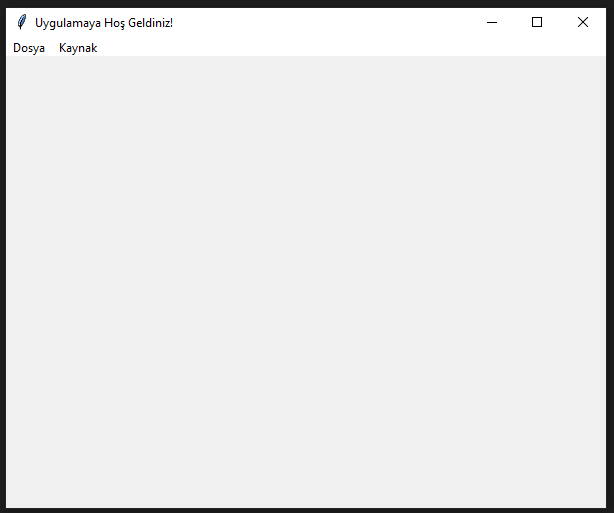

Bir menü çubuğu oluşturmak için `Menu` sınıfını kullandık ve bunu `pencere` nesnesine ekledik.

```python
menu_cubugu = tk.Menu(pencere)
pencere.config(menu=menu_cubugu)
```

Ardından, "Dosya" ve "Kaynak" başlıklarına sahip iki alt menü oluşturduk.

```python
dosya = tk.Menu(menu_cubugu)
kaynak = tk.Menu(menu_cubugu)
```

Menü çubuğuna bu alt menüleri ekledik.

```python
menu_cubugu.add_cascade(label="Dosya", menu=dosya)
menu_cubugu.add_cascade(label="Kaynak", menu=kaynak)
```

"Dosya" alt menüsüne "Yeni Dosya" isminde bir komut ekledik ve bu komutun çalıştırılması durumunda `dosyaFonksiyonu` isimli bir fonksiyonu çağırmasını sağladık.

```python
dosya.add_command(label="Yeni Dosya", command=dosyaFonksiyonu)
```

"Kaynak" alt menüsüne "Veri" isminde bir komut ekledik ve bu komutun çalıştırılması durumunda `kaynakFonksiyonu` isimli bir fonksiyonu çağırmasını sağladık.

```python
kaynak.add_command(label="Veri", command=kaynakFonksiyonu)
```

Sırasıyla Dosya/Yeni Dosya ve Kaynak/Veri menülerini seçtiğimizde aşağıdaki çıktıları alacağız.

```
Yeni Dosya
Veri
```

### 2.13. Tabs

Tabs veya sekmeler bileşeni, kullanıcının farklı içerikleri aynı pencerede gruplandırmasına ve sekmeler arasında geçiş yapmasına olanak sağlar.

Uygulamamıza bileşen eklemeyi görelim.

```python
import tkinter as tk
from tkinter import ttk

pencere = tk.Tk()
pencere.geometry("600x450")
pencere.title("Uygulamaya Hoş Geldiniz!")

pencere.mainloop()
```

Sekmeyi oluşturalım.

```python
bilesenler = ttk.Notebook(
    window,
    width=550,
    height=400
)
bilesenler.place(x = 25, y = 25)
```

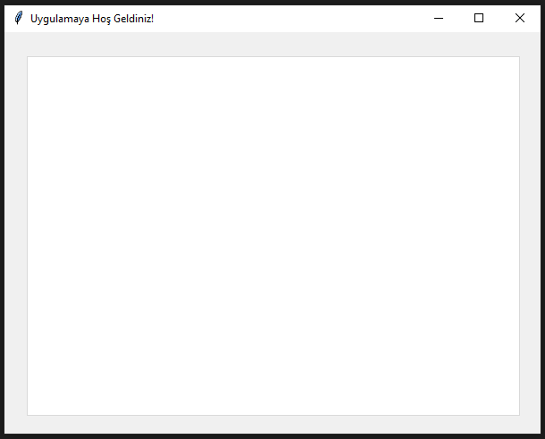

Yukarıda, `ttk.Notebook` sınıfından bir `bilesenler` nesnesi oluşturduk. Bu `bilesenler` nesnesi, `pencere` isimli bir pencereye yerleştirilmek üzere oluşturuldu. `width` ve `height` parametreleri kullanılarak genişlik ve yükseklik değerleri belirlendi. Bu, oluşturulan sekmelerin genişlik ve yükseklik boyutlarını belirlemektedir. Ardından, `place` yöntemi kullanılarak `bilesenler` nesnesi `25` ve `25` koordinatlarında `pencere` penceresine yerleştirilmiştir. Bu, sekmelerin penceredeki konumunu belirtir.

```python
bilesen1 = ttk.Frame(
    bilesenler,
    width=50,
    height=50
)

bilesen2 = ttk.Frame(
    bilesenler,
    width=50,
    height=50
)
```

Yukarıda, `ttk.Frame` sınıfından `bilesen1` ve `bilesen2` isminde iki farklı çerçeve oluşturduk. Her bir çerçeve, `bilesenler` isimli bir ana bileşenin içine yerleştirilmiştir. İlk olarak, `bilesen1` çerçevesi, `ttk.Frame` sınıfından bir örnekleme yaparak oluşturuldu. `width` ve `height` parametreleri kullanılarak çerçevenin genişlik ve yükseklik değerleri belirlendi. Benzer şekilde, `bilesen2` çerçevesi de `ttk.Frame` sınıfından bir örnekleme yaparak oluşturuldu ve `width` ve `height` parametreleri ile boyutları ayarlandı. Her iki çerçeve de `bilesenler` isimli bir ana bileşene eklenmek üzere oluşturuldu. Bu şekilde, `bilesen1` ve `bilesen2` çerçeveleri, `bilesenler` bileşeni içinde yer alacaktır.

```python
grafik = tk.Label(
    bilesen1,
    text="Grafik"
)
grafik.pack()

tablo = tk.Label(
    bilesen2,
    text="Tablo"
)
tablo.pack()
```

Yukarıda, `bilesen1` ve `bilesen2` çerçevelerine `tk.Label` bileşenleri eklenerek ve değişkenlere atanarak metin içeren etiketler oluşturuldu. İlk olarak, `bilesen1` çerçevesi içinde bir `tk.Label` bileşeni oluşturuldu. `text` parametresi, etikette görüntülenecek metni belirtir. Bu örnekte, metin "Grafik" olarak belirlenmiştir. `pack` yöntemi, etiket bileşenini çerçevenin içinde yerleştirmek için kullanılır. Benzer şekilde, `bilesen2` çerçevesi içinde de bir `tk.Label` bileşeni oluşturulur. `text` parametresi, etikette görüntülenecek metni belirtir. Bu örnekte, metin "Tablo" olarak belirlenmiştir. `pack` yöntemi, etiket bileşenini çerçevenin içinde yerleştirmek için kullanılır. Bu şekilde, her bir çerçeve içinde bir metin etiketi oluşturulur ve ilgili çerçevenin içine yerleştirilir. Etiketler, çerçevelerin içeriğini temsil eden metinleri gösterir.

```python
bilesenler.add(
    bilesen1,
    text="Grafik"
)

bilesenler.add(
    bilesen2,
    text="Tablo"
)
```

Yukarıda, `bilesenler` isimli bir `ttk.Notebook` bileşenine `bilesen1` ve `bilesen2` isimli çerçeveleri ekledik. İlk olarak, `bilesenler` bileşeni üzerinde `add` yöntemi kullanılarak `bilesen1` çerçevesi eklendi. `text` parametresi, bu çerçevenin sekme başlığı olarak görüntülenecek metni belirtir. Bu örnekte, sekme başlığı "Tablo" olarak belirlenmiştir. Benzer şekilde, `bilesenler` bileşeni üzerinde `add` yöntemi kullanılarak `bilesen2` çerçevesi de eklendi. `text` parametresi, bu çerçevenin sekme başlığını belirtir. Bu örnekte, sekme başlığı "Grafik" olarak belirlenmiştir. Bu şekilde, `bilesen1` ve `bilesen2` çerçeveleri, `bilesenler` bileşenine eklenir ve ilgili sekme başlıklarıyla birlikte görüntülenir.

Tüm kodu bir arada görelim.

```python
import tkinter as tk
from tkinter import ttk

pencere = tk.Tk()
pencere.geometry("600x450")
pencere.title("Uygulamaya Hoş Geldiniz!")

bilesenler = ttk.Notebook(
    pencere,
    width=550,
    height=400
)
bilesenler.place(x = 25, y = 25)

bilesen1 = ttk.Frame(
    bilesenler,
    width=50,
    height=50
)

bilesen2 = ttk.Frame(
    bilesenler,
    width=50,
    height=50
)

grafik = tk.Label(
    bilesen1,
    text="Grafik"
)
grafik.pack()

tablo = tk.Label(
    bilesen2,
    text="Tablo"
)
tablo.pack()

bilesenler.add(
    bilesen1,
    text="Grafik"
)

bilesenler.add(
    bilesen2,
    text="Tablo"
)

pencere.mainloop()
```

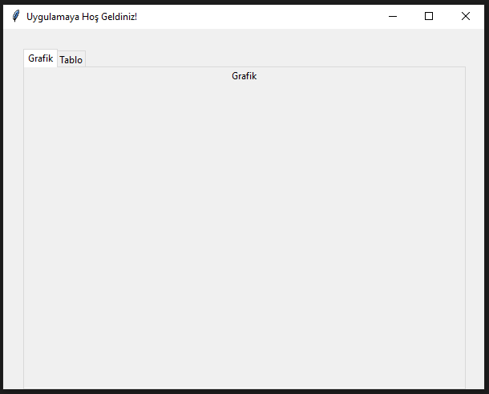

### 2.14. Treeview

Treeview veya ağaç görünümü bileşeni, bir ağaç yapısı şeklinde verileri göstermek için kullanılır.

Sekmeler yapısını bozmayalım.

```python
import tkinter as tk
from tkinter import ttk

pencere = tk.Tk()
pencere.geometry("600x450")
pencere.title("Uygulamaya Hoş Geldiniz!")

bilesenler = ttk.Notebook(
    pencere,
    width=550,
    height=400
)
bilesenler.place(x = 25, y = 25)

bilesen1 = ttk.Frame(
    bilesenler,
    width=50,
    height=50
)

bilesen2 = ttk.Frame(
    bilesenler,
    width=50,
    height=50
)

grafik = tk.Label(
    bilesen1,
    text="Grafik"
)
grafik.pack()

tablo = tk.Label(
    bilesen2,
    text="Tablo"
)
tablo.pack()

bilesenler.add(
    bilesen1,
    text="Grafik"
)

bilesenler.add(
    bilesen2,
    text="Tablo"
)

pencere.mainloop()
```

Ağaç görünümünü oluşturalım.

```python
agac_yapisi = ttk.Treeview(bilesen2)
agac_yapisi.place(x=10, y=10)
```

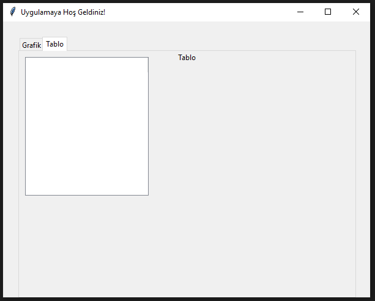

Görüldüğü üzere Tablo sekmesine ekledik.

```python
agac_yapisi.insert("", "0", "item1", text="Türkiye")
agac_yapisi.insert("item1", "1", "item1_1", text="İstanbul")
agac_yapisi.insert("", "2", "item2", text="Yunanistan")
agac_yapisi.insert("item2", "3", "item2_1", text="Atina")
```

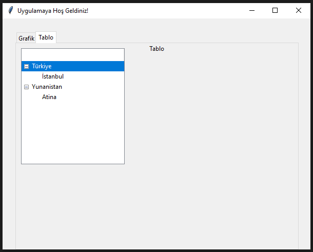

İlk satırda, kök düğüm olarak "" (boş bir dize) belirtilerek "item1" isminde bir düğüm eklendi. Bu düğümün metni "Türkiye" olarak belirlenmiştir. İkinci satırda, "item1" düğümüne bağlı olarak "item1_1" isminde bir alt düğüm eklendi. Bu alt düğümün metni "İstanbul" olarak belirlenmiştir. Üçüncü satırda, yine kök düğüm olarak "" (boş bir dize) belirtilerek "item2" isminde bir düğüm eklendi. Bu düğümün metni "Yunanistan" olarak belirlenmiştir. Dördüncü satırda, "item2" düğümüne bağlı olarak "item2_1" isminde bir alt düğüm eklendi. Bu alt düğümün metni "Atina" olarak belirlenmiştir.

İçeriği şöyle açıklayalım. Örnek olarak ilkini inceleyelim.

İlk parametre olan "" (boş bir dize), yeni düğümün ekleneceği düğümün kimliğini belirtir. Boş bir dize verildiğinde, yeni düğümün doğrudan kök düğüm olacağını gösterir. İkinci parametre olan "0", yeni düğümün sıralama indeksini belirtir. Burada "0" kullanıldığına göre, yeni düğüm listenin başına eklenir. Üçüncü parametre olan "item1", yeni düğümün benzersiz bir kimliğini belirtir. Bu kimlik, daha sonra düğümü işaretlemek veya başvurmak için kullanılabilir. `text="Türkiye"` ifadesi, yeni düğümün görünen metnini belirtir. Yani, Treeview'da görünecek olan metin "Türkiye" olarak ayarlanır.

Son olarak, seçim yapıldığı zaman ekrana basalım.

```python
def callback(event):
    item = agac_yapisi.identify("item", event.x, event.y)
    print(item)
```

Bu kod parçası, bir olay (event) gerçekleştiğinde (fare tıklaması), `callback` isimli bir fonksiyonu çağırır. `agac_yapisi.identify("item", event.x, event.y)` ifadesi, ağaç görünümü bileşenindeki belirli bir koordinatta (`event.x` ve `event.y`) bulunan öğeyi belirlemek için kullanılır. Bu koordinatlara denk gelen bir öğe (düğüm) varsa, bu düğümün kimliği (item) döndürülür. `print(item)` ifadesi, belirlenen öğenin kimliğini konsola yazdırır. Yani, bu kod parçası, bir olay gerçekleştiğinde ağaç görünümü bileşenindeki tıklanan öğenin kimliğini bulup konsola yazdırır. Bu, kullanıcı etkileşimlerini takip etmek veya belirli bir öğenin tıklanmasına yanıt vermek gibi işlevler için kullanılabilir.

```python
agac_yapisi.bind("<Double-1>",callback)
```

Bu kod parçası ise, `agac_yapisi` ağaç görünüm bileşenine bir olay bağlamayı sağlar. `bind` yöntemi kullanılarak belirli bir olaya (event) belirli bir işlevin (`callback`) atanması sağlanır. `"<Double-1>"` ifadesi, fare ile çift tıklama olayını temsil eder. Yani, kullanıcı ağaç görünüm bileşeninde bir öğeye çift tıkladığında bu olay tetiklenir. `callback` fonksiyonu, önceki yanıtta açıklanan `callback` fonksiyonunu temsil eder. Yani, çift tıklama olayı gerçekleştiğinde `callback` fonksiyonu çağrılır. Bu şekilde, `agac_yapisi` ağaç görünüm bileşeninde bir öğeye çift tıklandığında, `callback` fonksiyonu çalıştırılır ve tıklanan öğenin kimliği konsola yazdırılır. Örnek olarak, İstanbul'a tıklayalım. Bu durumda `item1_1` çıktısını alacağız.

### 2.15. Listbox

Listbox veya liste kutusu bileşeni, kullanıcıya birden fazla seçeneği olan bir liste sunmak için kullanılır. Her bir seçenek, liste kutusu içinde ayrı bir öğe olarak temsil edilir.

Sekmeler yapısını bozmayalım ancak ağaç görünümü yapısını kaldıralım.

```python
import tkinter as tk
from tkinter import ttk

pencere = tk.Tk()
pencere.geometry("600x450")
pencere.title("Uygulamaya Hoş Geldiniz!")

bilesenler = ttk.Notebook(
    pencere,
    width=550,
    height=400
)
bilesenler.place(x = 25, y = 25)

bilesen1 = ttk.Frame(
    bilesenler,
    width=50,
    height=50
)

bilesen2 = ttk.Frame(
    bilesenler,
    width=50,
    height=50
)

grafik = tk.Label(
    bilesen1,
    text="Grafik"
)
grafik.pack()

tablo = tk.Label(
    bilesen2,
    text="Tablo"
)
tablo.pack()

bilesenler.add(
    bilesen1,
    text="Grafik"
)

bilesenler.add(
    bilesen2,
    text="Tablo"
)

pencere.mainloop()
```

Liste kutusunu oluşturalım.

```python
liste = tk.Listbox(bilesen2, selectmode=tk.MULTIPLE)
```

Yukarıda, `liste` isminde bir liste kutusu öğesi oluşturuldu. Bu öğe, `bilesen2` isimli bir üst düğüm (parent) içine yerleştirildi.

```python
liste.insert(0, "Python")
liste.insert(1, "Java")
```

Yukarıdaki kod, `liste` isimli bir liste kutusu bileşenine "Python" ve "Java" olarak isimlendirilen iki öğe ekler. Öğelerin sırasıyla `0` ve `1` indeksli pozisyonlara eklenmesi sağlandı.

```python
liste.place(x=5, y=5)
```

Yukarıdaki kod, `liste` isimli iste kutusu bileşenini piksel bazında belirli bir konuma yerleştirmek için kullanıldı.

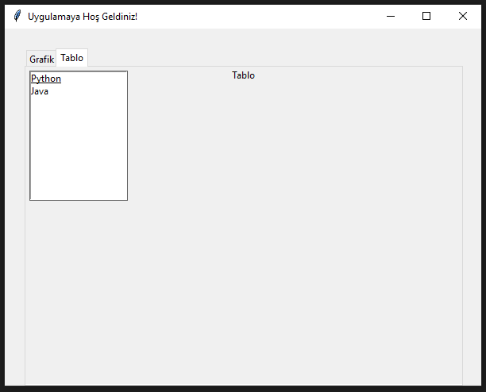

```python
def listeOgeleri():
    liste_indeks = liste.curselection()
    print(liste_indeks)

    for l in liste_indeks:
        print(liste.get(l))

buton = tk.Button(
    bilesen2,
    text="Seç",
    command=listeOgeleri
)
buton.place(x=10, y=175)
```

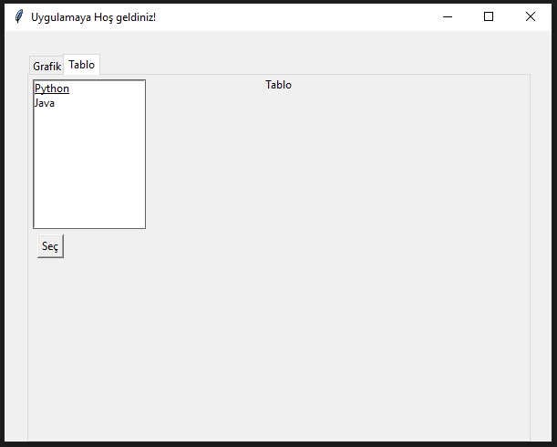

Yukarıda, `listeOgeleri()` isminde bir fonksiyon tanımladık. Bu fonksiyon, `liste` bilşeninde seçili öğeleri almak ve seçili öğelerin değerlerini yazdırmak için kullanılır. Ayrıca, `buton` isminde bir bileşen oluşturduk. Bu buton, "Seç" olarak görünen bir metin içerir ve `listeOgeleri` fonksiyonunu tetikleyen bir komut olarak ayarlandı. Bu buton, `bilesen2` içinde (varsayılan olarak oluşturulan bir üst düğüm) (10, 175) piksel konumuna yerleştirildi.

Kodun tamamını görelim.

```python
import tkinter as tk
from tkinter import ttk

pencere = tk.Tk()
pencere.geometry("600x450")
pencere.title("Uygulamaya Hoş Geldiniz!")

bilesenler = ttk.Notebook(
    pencere,
    width=550,
    height=400
)
bilesenler.place(x = 25, y = 25)

bilesen1 = ttk.Frame(
    bilesenler,
    width=50,
    height=50
)

bilesen2 = ttk.Frame(
    bilesenler,
    width=50,
    height=50
)

grafik = tk.Label(
    bilesen1,
    text="Grafik"
)
grafik.pack()

tablo = tk.Label(
    bilesen2,
    text="Tablo"
)
tablo.pack()

bilesenler.add(
    bilesen1,
    text="Grafik"
)

bilesenler.add(
    bilesen2,
    text="Tablo"
)

liste = tk.Listbox(bilesen2, selectmode=tk.MULTIPLE)

liste.insert(0, "Python")
liste.insert(1, "Java")

liste.place(x=5, y=5)

def listeOgeleri():
    liste_indeks = liste.curselection()
    print(liste_indeks)

    for l in liste_indeks:
        print(liste.get(l))

buton = tk.Button(
    bilesen2,
    text="Seç",
    command=listeOgeleri
)
buton.place(x=10, y=175)

pencere.mainloop()
```

Liste kutusundan şu seçim sıralamasını yapalım: Python, Python'ı kaldırıp Java, her ikisi. Her bir işlemde butona tıkladığımızda aşağıdaki çıktıları alacağız.

```
(0,)
Python
(1,)
Java
(0, 1)
Python
Java
```

### 2.16. Text Editor

Text editor veya metin düzenleyici bileşeni, kullanıcının metin girişi ve düzenlemeler yapabileceği bir çok satırlı metin alanı sağlar.

Sekmeler yapısını bozmayalım ancak liste kutusu yapısını kaldıralım.

```python
import tkinter as tk
from tkinter import ttk

pencere = tk.Tk()
pencere.geometry("600x450")
pencere.title("Uygulamaya Hoş Geldiniz!")

bilesenler = ttk.Notebook(
    pencere,
    width=550,
    height=400
)
bilesenler.place(x = 25, y = 25)

bilesen1 = ttk.Frame(
    bilesenler,
    width=50,
    height=50
)

bilesen2 = ttk.Frame(
    bilesenler,
    width=50,
    height=50
)

grafik = tk.Label(
    bilesen1,
    text="Grafik"
)
grafik.pack()

tablo = tk.Label(
    bilesen2,
    text="Tablo"
)
tablo.pack()

bilesenler.add(
    bilesen1,
    text="Grafik"
)

bilesenler.add(
    bilesen2,
    text="Tablo"
)

pencere.mainloop()
```

Metin düzenleyiciyi oluşturalım.

```python
metin = tk.Text(
    bilesen2,
    width=40,
    height=10,
    wrap=tk.WORD
)
metin.pack(fill=tk.BOTH, expand=True)
```

Bu kod bloğunda, `metin` isimli bir metin bileşeni oluşturulmuştur. Bu bileşen, çok satırlı metin girişi için kullanılır. `width` parametresi, bileşenin yatayda genişliğini ayarlar. `height` parametresi ise bileşenin dikeyde yüksekliğini ayarlar. `wrap=tk.WORD` parametresi, metin kutusunun satır sonlarında otomatik olarak kelime bölmesi yapmasını sağlar. Bu şekilde, satır sonuna geldiğinde kelimelerin tamamı bir sonraki satıra kayar. `metin.pack(fill=tk.BOTH, expand=True)` satırı, metin bileşenini `bilesen2` isimli çerçeve içinde yerleştirir. `fill=tk.BOTH` parametresi, bileşenin hem yatayda hem de dikeyde alanı doldurmasını sağlar. `expand=True` parametresi, bileşenin kullanılabilir alanda genişlemesini sağlar.

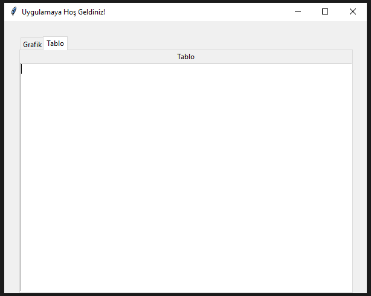

Metin kutusuna yazılan yazıyı ekrana basalım.

```python
def metinFonksiyonu():
    print(metin.get(1.0, tk.END))

buton = tk.Button(bilesen2, text="Kaydet", command=metinFonksiyonu)
buton.pack(pady=10)
```

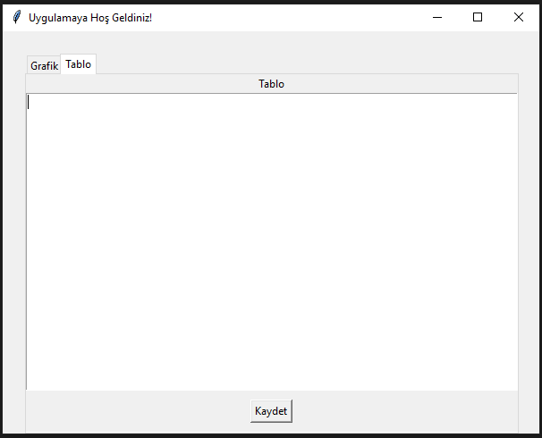

Bu kod bloğunda ise `metinFonksiyonu` isimli bir fonksiyon tanımlanmıştır. Bu fonksiyon, `metin` isimli metin kutusundan girilen metni alır ve ekrana yazdırır. `metin.get(1.0, tk.END)` ifadesi, metin kutusundaki metni almak için kullanılır. İlk satırdan (1.0) başlayarak, tüm metni almak için `tk.END` ifadesi kullanılır. Ardından, `buton` isimli bir bileşen oluşturulur. Bu butonun metni "Kaydet" olarak belirlenmiştir. `command` parametresi, butona tıklandığında `metinFonksiyonu` fonksiyonunun çağrılmasını sağlar. Yani, butona tıklandığında metin kutusundaki metin alınıp ekrana yazdırılır. Son olarak, `buton.pack(pady=10)` satırı, butonun `bilesen2` çerçevesine yerleştirilmesini sağlar. `pady=10` parametresi, butonun üst ve alt kenarlarından 10 piksel boşluk bırakır.

Butona bastığımızda ekrana yazılan metni ekrana basacaktır.

### 2.17. Scroll Bar

Bir scroll bar veya kaydırma çubuğu, genellikle bir içerik alanının (çok satırlı metin, liste veya tablo gibi) sınırlarını aşan içeriği görüntülemek için dikey veya yatay olarak kullanılabilir. Kaydırma çubuğu, kullanıcıya içeriği yukarı, aşağı, sola veya sağa kaydırma imkanı verir. Kullanıcı kaydırma çubuğunu kullanarak içeriği görüntüledikçe içeriğin görüntülenen bölümü değişir.

Önceki yapıyı bozmayalım.

```python
import tkinter as tk
from tkinter import ttk

pencere = tk.Tk()
pencere.geometry("600x450")
pencere.title("Uygulamaya Hoş Geldiniz!")

bilesenler = ttk.Notebook(pencere, width=550, height=400)
bilesenler.place(x=25, y=25)

bilesen1 = ttk.Frame(bilesenler, width=50, height=50)
bilesen2 = ttk.Frame(bilesenler, width=50, height=50)

grafik = tk.Label(bilesen1, text="Grafik")
grafik.pack()

tablo = tk.Label(bilesen2, text="Tablo")
tablo.pack()

bilesenler.add(bilesen1, text="Grafik")
bilesenler.add(bilesen2, text="Tablo")

metin = tk.Text(
    bilesen2,
    width=40,
    height=10,
    wrap=tk.WORD
)
metin.pack(fill=tk.BOTH, expand=True)

def metinFonksiyonu():
    print(metin.get(1.0, tk.END))

buton = tk.Button(bilesen2, text="Kaydet", command=metinFonksiyonu)
buton.pack(pady=10)

pencere.mainloop()
```

Tablo sekmesine bir kadırma çubuğu ekleyelim.

```python
kaydirma_cubugu = tk.Scrollbar(metin, orient=tk.VERTICAL, command=metin.yview)
kaydirma_cubugu.pack(side=tk.RIGHT, fill=tk.Y)
metin.config(yscrollcommand=kaydirma_cubugu.set)
```

Bu kod parçasında `kaydirma_cubugu` isminde bir kaydırma çubuğu oluşturduk. Bu çubuğun yatayda yerine dikey olarak kullanılması için `orient=tk.VERTICAL` parametresini verdik. `command=metin.yview` ise kaydırma çubuğunun metin kutusuyla senkronize çalışmasını sağlar. Daha sonra `kaydirma_cubugu.pack(side=tk.RIGHT, fill=tk.Y)` ile kaydırma çubuğunu sağ tarafa (`side=tk.RIGHT`) ve dikeyde (`fill=tk.Y`) metin kutusunun içine yerleştirdik. Son olarak `metin.config(yscrollcommand=kaydirma_cubugu.set)` ile metin kutusunu kaydırma çubuğu ile senkronize hale getirdik. Bu sayede kaydırma çubuğu hareket ettikçe metin kutusu da kaydırılır.

Kodun tamamını görelim.

```python
import tkinter as tk
from tkinter import ttk

pencere = tk.Tk()
pencere.geometry("600x450")
pencere.title("Uygulamaya Hoş Geldiniz!")

bilesenler = ttk.Notebook(pencere, width=550, height=400)
bilesenler.place(x=25, y=25)

bilesen1 = ttk.Frame(bilesenler, width=50, height=50)
bilesen2 = ttk.Frame(bilesenler, width=50, height=50)

grafik = tk.Label(bilesen1, text="Grafik")
grafik.pack()

tablo = tk.Label(bilesen2, text="Tablo")
tablo.pack()

bilesenler.add(bilesen1, text="Grafik")
bilesenler.add(bilesen2, text="Tablo")

metin = tk.Text(
    bilesen2,
    width=40,
    height=10,
    wrap=tk.WORD
)
metin.pack(fill=tk.BOTH, expand=True)

kaydirma_cubugu = tk.Scrollbar(metin, orient=tk.VERTICAL, command=metin.yview)
kaydirma_cubugu.pack(side=tk.RIGHT, fill=tk.Y)
metin.config(yscrollcommand=kaydirma_cubugu.set)

def metinFonksiyonu():
    print(metin.get(1.0, tk.END))

buton = tk.Button(bilesen2, text="Kaydet", command=metinFonksiyonu)
buton.pack(pady=10)

pencere.mainloop()
```

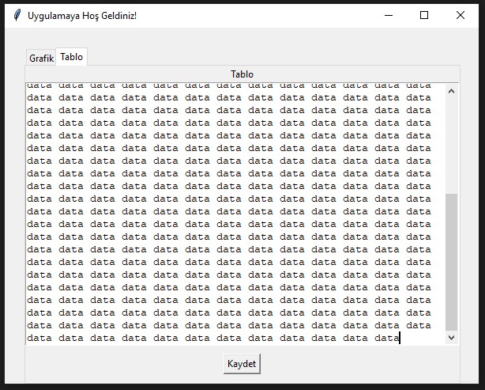

### 2.18. File Dialog

Kullanıcının dosya seçmesini sağlamak için genellikle bir dosya iletişim kutusu (file dialog) kullanılır.

Öncelikle aşağıdaki modüller import ediyoruz.

```python
from tkinter import filedialog
from PIL import ImageTk, Image
```

Aşağıdaki gibi başlıyoruz.

```python
import tkinter as tk
from tkinter import ttk
from tkinter import filedialog
from PIL import ImageTk, Image

pencere = tk.Tk()
pencere.title("Uygulamaya Hoş Geldiniz!")
pencere.geometry("600x450")

pencere.mainloop()
```

Önce seçimin yapılabilmesi için bir buton ekleyelim.

```python
def dosyaAc():
    pass

buton = tk.Button(
    window,
    text="Dosya Aç",
    command=dosyaAc
)
buton.pack()
```

Fonksiyonu dolduralım.

```python
def dosyaAc():
    dosya = filedialog.askopenfilename(initialdir="C:/Users/Uraz/Desktop", title="Bir dosya seç...")
    print(dosya)
```

`filedialog.askopenfilename()` fonksiyonu, bir dosya seçme iletişim kutusu açar ve kullanıcının bir dosya seçmesini bekler. Fonksiyon çağrıldığında, `initialdir` parametresi belirtilen dizinde (bu durumda "C:/Users/Uraz/Desktop") başlar ve `title` parametresiyle belirtilen başlık metnini kullanarak iletişim kutusu penceresini gösterir. Kullanıcı bir dosya seçtikten sonra, seçilen dosyanın tam yolunu döndüren bir dize değeri döner. Bu değer, dosya değişkenine atanır ve `print(dosya)` ifadesiyle ekrana yazdırılır.

```python
def dosyaAc():
    dosya = filedialog.askopenfilename(initialdir="C:/Users/Uraz/Desktop", title="Bir dosya seç...")
    print(dosya)

    resim = Image.open(dosya)
    resim = ImageTk.PhotoImage(resim)
```

Eklediğimiz kod, seçilen dosyanın bir resim dosyası olduğunu varsayarak, seçilen resmi açıp görüntülemek için PIL (Python Imaging Library) ve Tkinter'ın Image ve ImageTk modüllerini kullanıyor.

```python
def dosyaAc():
    dosya = filedialog.askopenfilename(initialdir="C:/Users/Uraz/Desktop", title="Bir dosya seç...")
    print(dosya)

    resim = Image.open(dosya)
    resim = ImageTk.PhotoImage(resim)

    etiket = tk.Label(pencere, image=resim)
    etiket.image = resim
    etiket.pack(padx=20, pady=20)
```

`tk.Label()` fonksiyonu kullanılarak bir etiket nesnesi oluşturulur. Bu etiket nesnesi, `pencere` isimli bir Tkinter penceresine bağlanır ve `image` parametresi ile görüntülenecek resmi belirtir. Daha sonra, `etiket.image = resim` ifadesiyle etiket nesnesinin image özelliğine resim değişkeni atanır. Bu, görüntünün etiketle ilişkilendirilmesini sağlar. Son olarak, `etiket.pack()` yöntemi kullanılarak etiket pencereye x ve y koordinatlarına göre eklenir ve görüntülenir.

Kodun tamamını görelim.

```python
import tkinter as tk
from tkinter import ttk
from tkinter import filedialog
from PIL import ImageTk, Image

pencere = tk.Tk()
pencere.title("Uygulamaya Hoş Geldiniz!")
pencere.geometry("600x450")

def dosyaAc():
    dosya = filedialog.askopenfilename(initialdir="C:/Users/Uraz/Desktop", title="Bir dosya seç...")
    print(dosya)

    resim = Image.open(dosya)
    resim = ImageTk.PhotoImage(resim)

    etiket = tk.Label(pencere, image=resim)
    etiket.image = resim
    etiket.pack(padx=20, pady=20)

buton = tk.Button(
    pencere,
    text="Dosya Aç",
    command=dosyaAc
)
buton.pack()

pencere.mainloop()
```


### 2.19. Plot

Görselleştirme için aşağıdaki modülleri import ediyoruz.

```python
from matplotlib.figure import Figure
from matplotlib.backends.backend_tkagg import FigureCanvasTkAgg
import numpy as np
```

Aşağıdaki gibi başlıyoruz.

```python
import tkinter as tk
from tkinter import ttk
from matplotlib.figure import Figure
from matplotlib.backends.backend_tkagg import FigureCanvasTkAgg
import numpy as np

pencere = tk.Tk()
pencere.title("Uygulamaya Hoş Geldiniz!")
pencere.geometry("600x450")

pencere.mainloop()
```

Görselleştirme ve yerleştirmeyi aşağıdaki gibi yapıyoruz.

```python
def plot_zaman_serisi():
    t = np.arange(0, 10, 0.1)
    y = np.random.randn(len(t))

    figure = Figure(figsize=(5, 4), dpi=100)
    plot = figure.add_subplot(111)
    plot.plot(t, y)

    canvas = FigureCanvasTkAgg(figure, master=pencere)
    canvas.draw()
    canvas.get_tk_widget().pack()

button = ttk.Button(pencere, text="Zaman Serisini Çiz", command=plot_zaman_serisi)
button.pack()
```

İlk olarak, matplotlib.figure modülünden Figure sınıfını ve matplotlib.backends.backend_tkagg modülünden FigureCanvasTkAgg sınıfını içe aktarıyoruz. numpy modülünden de np adıyla içe aktarılıyor.

`plot_zaman_serisi` isminde bir fonksiyon tanımlıyoruz. Bu fonksiyon, zaman serisini oluşturup çizen kodları içerecek. `plot_zaman_serisi` fonksiyonunda, `np.arange` fonksiyonunu kullanarak 0'dan 10'a kadar olan sayıları 0.1 aralıklarla içeren bir dizi (t) oluşturuyoruz. Ayrıca, `np.random.randn` fonksiyonunu kullanarak t dizisinin uzunluğu kadar rasgele sayılardan oluşan bir dizi (y) oluşturuyoruz.

Figure sınıfından bir örnek oluşturarak (`figure`), çizimi yapacağımız alanı belirliyoruz. `figsize` parametresi ile çizimin boyutunu, `dpi` parametresi ile çözünürlüğünü ayarlıyoruz. Ardından, `figure` nesnesine bir alt çizim ekleyerek (`add_subplot(111)`) çizimi yapacağımız alana erişiyoruz. Bu alt çizim (plot) üzerine, t ve y dizilerini kullanarak bir çizgi grafiği çiziyoruz.

FigureCanvasTkAgg sınıfından bir örnek oluşturarak (`canvas`), çizimi yapacağınız alanı pencere isimli ana pencereye yerleştiriyoruz. `canvas.draw()` yöntemini kullanarak çizimi gerçekleştiriyoruz.

`canvas.get_tk_widget().pack()` koduyla, `canvas` öğesini pencereye yerleştiriyoruz. Bu, çizimin gösterildiği bir grafik alanını ekranda görünür hale getirir.

Son olarak bildiğimiz buton bileşenini oluşturduk.

Kodun tamamını görelim.

```python
import tkinter as tk
from tkinter import ttk
from matplotlib.figure import Figure
from matplotlib.backends.backend_tkagg import FigureCanvasTkAgg
import numpy as np

pencere = tk.Tk()
pencere.title("Uygulamaya Hoş Geldiniz!")
pencere.geometry("600x450")

def plot_zaman_serisi():
    t = np.arange(0, 10, 0.1)
    y = np.random.randn(len(t))

    figure = Figure(figsize=(5, 4), dpi=100)
    plot = figure.add_subplot(111)
    plot.plot(t, y)

    canvas = FigureCanvasTkAgg(figure, master=pencere)
    canvas.draw()
    canvas.get_tk_widget().pack()

button = ttk.Button(pencere, text="Zaman Serisini Çiz", command=plot_zaman_serisi)
button.pack()

pencere.mainloop()
```

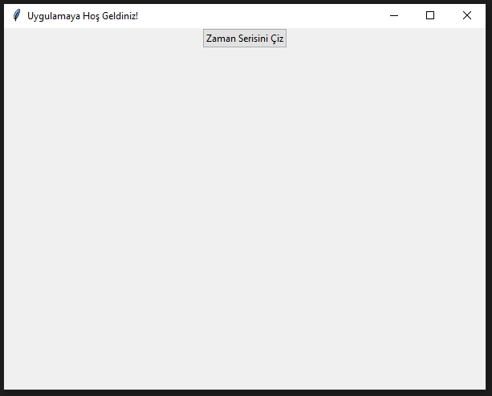

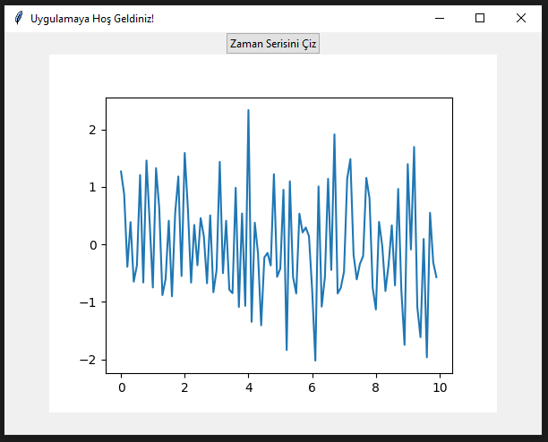

### 2.20. Mouse Event

Mouse event (fare olayı), fareyle gerçekleştirilen etkileşimleri yakalamak ve işlemek için kullanılan bir mekanizmadır.

Ekranda; mouse ile sola basınca sol, ortaya basınca orta ve sağa basınca sağ yazsın.

```python
import tkinter as tk
from tkinter import ttk

pencere = tk.Tk()
pencere.title("Uygulamaya Hoş Geldiniz!")
pencere.geometry("600x450")

def solTik(event):
    tk.Label(pencere, text="Sol").pack(padx=20, pady=20)

def ortaTik(event):
    tk.Label(pencere, text="Orta").pack(padx=20, pady=20)

def sagTik(event):
    tk.Label(pencere, text="Sağ").pack(padx=20, pady=20)

pencere.bind("<Button-1>", solTik)
pencere.bind("<Button-2>", ortaTik)
pencere.bind("<Button-3>", sagTik)

pencere.mainloop()
```

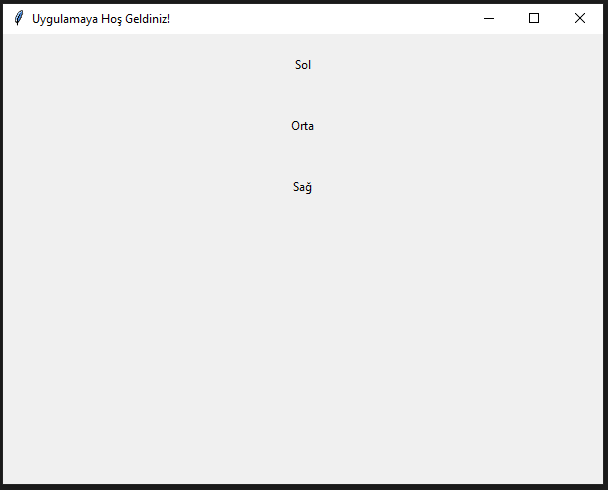

### 2.21. Date Picker

Date picker ya da tarih seçici bileşeni, kullanıcının bir tarih seçmesine yardımcı olur.

Bu bileşeni kullanmak için aşağıdaki modülü import etmemiz gerekiyor.

```python
from tkcalendar import Calendar
```

Aşağıdaki gibi başlıyoruz.

```python
import tkinter as tk
from tkinter import ttk
from tkcalendar import Calendar

pencere = tk.Tk()
pencere.title("Uygulamaya Hoş Geldiniz!")
pencere.geometry("600x450")

pencere.mainloop()
```

Tarih seçiciyi ekleyelim.

```python
tarih = Calendar(
    pencere,
    selectmode="day",
    date_pattern="dd/MM/yyyy"
)
tarih.pack()
```

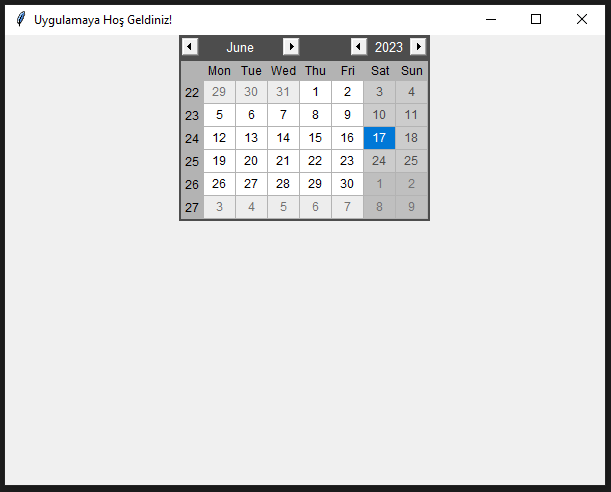

Neler yaptığımıza bakalım.

Yukarıda, `Calendar` sınıfından bir `tarih` nesnesi oluşturuyoruz. Bu, tkcalendar kütüphanesinden gelen bir takvim bileşenini temsil eder. İçine `pencere` parametresi geçirerek takvim bileşenini bir pencereye ekliyoruz. `selectmode="day"` belirterek, kullanıcının yalnızca bir gün seçebileceğini belirtiyoruz. `date_pattern="dd/MM/yyyy"` ile tarih biçimini belirtiyoruz, bu durumda gün/ay/yıl formatında olacaktır. `pack` yöntemini kullanarak tarih takvim bileşenini pencereye yerleştiriyoruz.

Şimdi bir buton ekleyelim. Bu butona tıklayınca `secilenTarih` fonksiyonu çalışsın ve ekrana tarihi yazsın.

```python
import tkinter as tk
from tkinter import ttk
from tkcalendar import Calendar

pencere = tk.Tk()
pencere.title("Uygulamaya Hoş Geldiniz!")
pencere.geometry("600x450")

def secilenTarih():
    secilen_tarih = tarih.get_date()
    print(f"Seçilen tarih: {secilen_tarih}")

tarih = Calendar(
    pencere,
    selectmode="day",
    date_pattern="dd/MM/yyyy"
)
tarih.pack()

button = tk.Button(pencere, text="Tarih Seç", command=secilenTarih)
button.pack()

pencere.mainloop()
```

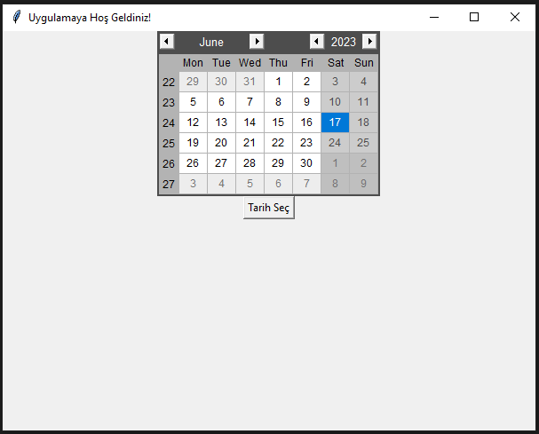

Örnek çıktı aşağıdaki gibi olacaktır.

```
Seçilen tarih: 17/06/2023
```

# 3. Uygulama: Hisse Senedi Görüntüleyici (Stock Viewer)

---

Seçilen bir hisse senedine ait verilerin hem tablo hem de görsel olarak görüntülenmesini sağlayacak bir uygulama yapacağız.

Klasik girişimizi yapalım.

```python
import tkinter as tk
from tkinter import ttk

window = tk.Tk()
window.title("Stock Viewer")
window.geometry("950x600")

window.mainloop()
```

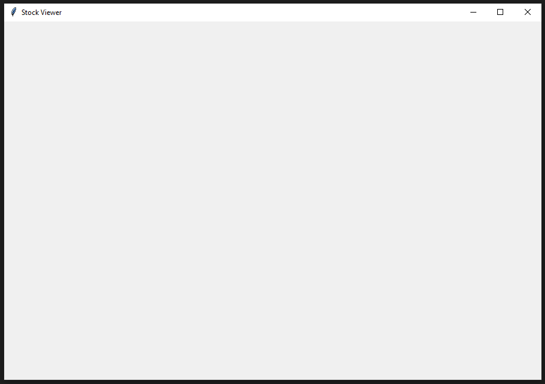

Sol tarafa bir çerçeve ekleyelim.

```python
import tkinter as tk
from tkinter import ttk

window = tk.Tk()
window.title("Stock Viewer")
window.geometry("950x600")

frame_left = tk.Frame(window)
frame_left.pack(side="left", padx=10, pady=10)

window.mainloop()
```

Kullanıcının sembolü girecek alanın metnini yazalım.

```python
import tkinter as tk
from tkinter import ttk

window = tk.Tk()
window.title("Stock Viewer")
window.geometry("950x600")

frame_left = tk.Frame(window)
frame_left.pack(side="left", padx=10, pady=10)

label_symbol = tk.Label(frame_left, text="Stock Symbol:")
label_symbol.pack()

window.mainloop()
```

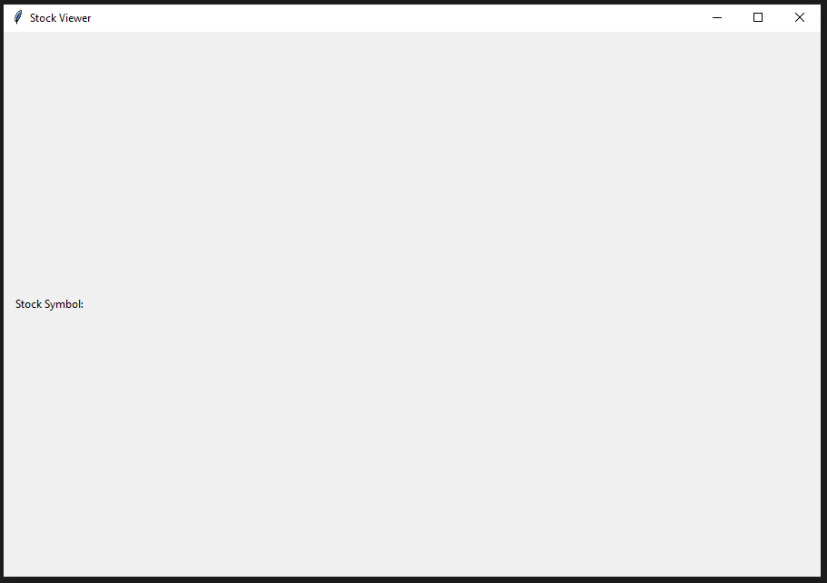

Kullanıcının sembolü manuel gireceği alanı oluşturalım.

```python
import tkinter as tk
from tkinter import ttk

window = tk.Tk()
window.title("Stock Viewer")
window.geometry("950x600")

frame_left = tk.Frame(window)
frame_left.pack(side="left", padx=10, pady=10)

label_symbol = tk.Label(frame_left, text="Stock Symbol:")
label_symbol.pack()

entry_symbol = tk.Entry(frame_left)
entry_symbol.pack()

window.mainloop()
```

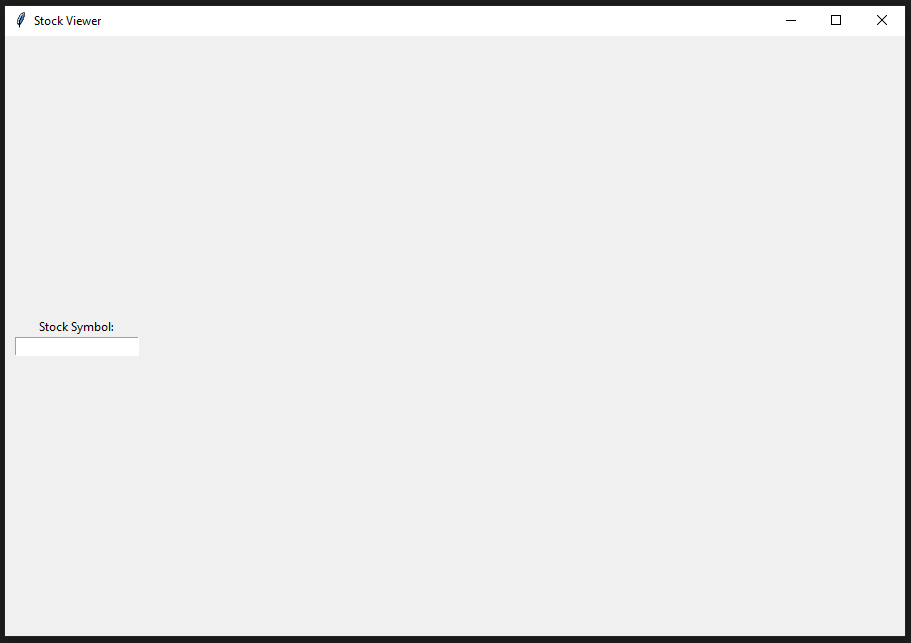

Kullanıcının başlangıç tarihini seçeceği alanı yapalım.

```python
import tkinter as tk
from tkinter import ttk
from tkcalendar import DateEntry

window = tk.Tk()
window.title("Stock Viewer")
window.geometry("950x600")

frame_left = tk.Frame(window)
frame_left.pack(side="left", padx=10, pady=10)

label_symbol = tk.Label(frame_left, text="Stock Symbol:")
label_symbol.pack()

entry_symbol = tk.Entry(frame_left)
entry_symbol.pack()

date_start = tk.Label(frame_left, text="Start Date:")
date_start.pack()
calendar_start = DateEntry(frame_left, width=12, background="darkblue", foreground="white", borderwidth=2)
calendar_start.pack()

window.mainloop()
```


Aynısını bitiş tarihi için yapalım.

```python
import tkinter as tk
from tkinter import ttk
from tkcalendar import DateEntry

window = tk.Tk()
window.title("Stock Viewer")
window.geometry("950x600")

frame_left = tk.Frame(window)
frame_left.pack(side="left", padx=10, pady=10)

label_symbol = tk.Label(frame_left, text="Stock Symbol:")
label_symbol.pack()

entry_symbol = tk.Entry(frame_left)
entry_symbol.pack()

date_start = tk.Label(frame_left, text="Start Date:")
date_start.pack()
calendar_start = DateEntry(frame_left, width=12, background="darkblue", foreground="white", borderwidth=2)
calendar_start.pack()

date_end = tk.Label(frame_left, text="End Date:")
date_end.pack()
calendar_end = DateEntry(frame_left, width=12, background="darkblue", foreground="white", borderwidth=2)
calendar_end.pack()

window.mainloop()
```


Kullanıcı gerekli bilgileri girdikten sonra veriyi gösterecek bir butona basacaktır. Bu butonu yapalım. Fonksiyonunu şimdilik pass yapıp geçeceğiz.

```python
import tkinter as tk
from tkinter import ttk
from tkcalendar import DateEntry

window = tk.Tk()
window.title("Stock Viewer")
window.geometry("950x600")

def show_data():
    pass

frame_left = tk.Frame(window)
frame_left.pack(side="left", padx=10, pady=10)

label_symbol = tk.Label(frame_left, text="Stock Symbol:")
label_symbol.pack()

entry_symbol = tk.Entry(frame_left)
entry_symbol.pack()

date_start = tk.Label(frame_left, text="Start Date:")
date_start.pack()
calendar_start = DateEntry(frame_left, width=12, background="darkblue", foreground="white", borderwidth=2)
calendar_start.pack()

date_end = tk.Label(frame_left, text="End Date:")
date_end.pack()
calendar_end = DateEntry(frame_left, width=12, background="darkblue", foreground="white", borderwidth=2)
calendar_end.pack()

button_show = tk.Button(frame_left, text="Show Data", command=show_data)
button_show.pack(pady=10)

window.mainloop()
```


Tablo ve grafiğe geçelim. Burada bir sekme yapısı olacak.

Önce tablo alanını ekleyelim.

```python
import tkinter as tk
from tkinter import ttk
from tkcalendar import DateEntry

window = tk.Tk()
window.title("Stock Viewer")
window.geometry("950x600")

def show_data():
    pass

frame_left = tk.Frame(window)
frame_left.pack(side="left", padx=10, pady=10)

label_symbol = tk.Label(frame_left, text="Stock Symbol:")
label_symbol.pack()

entry_symbol = tk.Entry(frame_left)
entry_symbol.pack()

date_start = tk.Label(frame_left, text="Start Date:")
date_start.pack()
calendar_start = DateEntry(frame_left, width=12, background="darkblue", foreground="white", borderwidth=2)
calendar_start.pack()

date_end = tk.Label(frame_left, text="End Date:")
date_end.pack()
calendar_end = DateEntry(frame_left, width=12, background="darkblue", foreground="white", borderwidth=2)
calendar_end.pack()

button_show = tk.Button(frame_left, text="Show Data", command=show_data)
button_show.pack(pady=10)

tab_control = ttk.Notebook(window)
tab_table = ttk.Frame(tab_control)
tab_control.add(tab_table, text="Table")

window.mainloop()
```

Şimdi de grafik alanını ekleyelim.

```python
import tkinter as tk
from tkinter import ttk
from tkcalendar import DateEntry

window = tk.Tk()
window.title("Stock Viewer")
window.geometry("950x600")

def show_data():
    pass

frame_left = tk.Frame(window)
frame_left.pack(side="left", padx=10, pady=10)

label_symbol = tk.Label(frame_left, text="Stock Symbol:")
label_symbol.pack()

entry_symbol = tk.Entry(frame_left)
entry_symbol.pack()

date_start = tk.Label(frame_left, text="Start Date:")
date_start.pack()
calendar_start = DateEntry(frame_left, width=12, background="darkblue", foreground="white", borderwidth=2)
calendar_start.pack()

date_end = tk.Label(frame_left, text="End Date:")
date_end.pack()
calendar_end = DateEntry(frame_left, width=12, background="darkblue", foreground="white", borderwidth=2)
calendar_end.pack()

button_show = tk.Button(frame_left, text="Show Data", command=show_data)
button_show.pack(pady=10)

tab_control = ttk.Notebook(window)
tab_table = ttk.Frame(tab_control)
tab_control.add(tab_table, text="Table")

tab_graph = ttk.Frame(tab_control)
tab_control.add(tab_graph, text="Graph")

window.mainloop()
```

Boyutları ayarlayalım.

```python
import tkinter as tk
from tkinter import ttk
from tkcalendar import DateEntry

window = tk.Tk()
window.title("Stock Viewer")
window.geometry("950x600")

def show_data():
    pass

frame_left = tk.Frame(window)
frame_left.pack(side="left", padx=10, pady=10)

label_symbol = tk.Label(frame_left, text="Stock Symbol:")
label_symbol.pack()

entry_symbol = tk.Entry(frame_left)
entry_symbol.pack()

date_start = tk.Label(frame_left, text="Start Date:")
date_start.pack()
calendar_start = DateEntry(frame_left, width=12, background="darkblue", foreground="white", borderwidth=2)
calendar_start.pack()

date_end = tk.Label(frame_left, text="End Date:")
date_end.pack()
calendar_end = DateEntry(frame_left, width=12, background="darkblue", foreground="white", borderwidth=2)
calendar_end.pack()

button_show = tk.Button(frame_left, text="Show Data", command=show_data)
button_show.pack(pady=10)

tab_control = ttk.Notebook(window)
tab_table = ttk.Frame(tab_control)
tab_control.add(tab_table, text="Table")

tab_graph = ttk.Frame(tab_control)
tab_control.add(tab_graph, text="Graph")

tab_control.pack(expand=1, fill="both")

window.mainloop()
```

Kalan tablo ayarlarını yapalım.

```python
import tkinter as tk
from tkinter import ttk
from tkcalendar import DateEntry

window = tk.Tk()
window.title("Stock Viewer")
window.geometry("950x600")

def show_data():
    pass

frame_left = tk.Frame(window)
frame_left.pack(side="left", padx=10, pady=10)

label_symbol = tk.Label(frame_left, text="Stock Symbol:")
label_symbol.pack()

entry_symbol = tk.Entry(frame_left)
entry_symbol.pack()

date_start = tk.Label(frame_left, text="Start Date:")
date_start.pack()
calendar_start = DateEntry(frame_left, width=12, background="darkblue", foreground="white", borderwidth=2)
calendar_start.pack()

date_end = tk.Label(frame_left, text="End Date:")
date_end.pack()
calendar_end = DateEntry(frame_left, width=12, background="darkblue", foreground="white", borderwidth=2)
calendar_end.pack()

button_show = tk.Button(frame_left, text="Show Data", command=show_data)
button_show.pack(pady=10)

tab_control = ttk.Notebook(window)
tab_table = ttk.Frame(tab_control)
tab_control.add(tab_table, text="Table")

tab_graph = ttk.Frame(tab_control)
tab_control.add(tab_graph, text="Graph")

tab_control.pack(expand=1, fill="both")

table = ttk.Treeview(tab_table)
table.grid(row=0, column=0, sticky="nsew")

scrollbar = ttk.Scrollbar(tab_table, orient="vertical", command=table.yview)
scrollbar.grid(row=0, column=1, sticky="ns")

table.configure(yscrollcommand=scrollbar.set)
table["show"] = "headings"

tab_table.grid_columnconfigure(0, weight=1)
tab_table.grid_rowconfigure(0, weight=1)

window.mainloop()
```


`show_data` fonksiyonunu oluşturalım.

```python
import tkinter as tk
from tkinter import ttk
from tkcalendar import DateEntry
from tkinter import messagebox
import yfinance as yf
import pandas as pd
from datetime import datetime
import matplotlib.pyplot as plt
from matplotlib.backends.backend_tkagg import FigureCanvasTkAgg
import matplotlib.dates as mdates

window = tk.Tk()
window.title("Stock Viewer")
window.geometry("950x600")

def show_data():
    # Verileri oku
    symbol = entry_symbol.get()
    start_date = calendar_start.get_date()
    end_date = calendar_end.get_date()
    try:
        # Hisse senedi verilerini al
        data = yf.download(symbol, start=start_date, end=end_date)
        df = pd.DataFrame(data)

        # Tarih sütununu ekle ve formatı çevir
        df.reset_index(inplace=True)
        df["Date"] = pd.to_datetime(df["Date"])

        # Satırları sayısal değerlere dönüştür ve yuvarla
        df[["Open", "High", "Low", "Close", "Adj Close"]] = df[["Open", "High", "Low", "Close", "Adj Close"]].round(1).astype(float)
        df[["Volume"]] = df[["Volume"]].astype(int)

        # Başka bir sembol girildiğinde tabloyu temizle
        table.delete(*table.get_children())

        # Tabloya verileri yerleştir
        table["columns"] = list(df.columns)
        for column in list(df.columns):
            table.column(column, width=100, anchor="center")
            table.heading(column, text=column, anchor="center")
        for index, row in df.iterrows():
            table.insert("", "end", values=list(row))

        # Grafik oluştur
        fig, ax = plt.subplots(figsize=(8, 6))
        ax.xaxis.set_major_formatter(mdates.DateFormatter("%Y-%m-%d"))
        ax.xaxis.set_major_locator(mdates.AutoDateLocator())
        ax.plot(df["Date"], df["Close"], linestyle="-", color="red")
        ax.set_xlabel("")
        ax.set_ylabel("Close Price")
        ax.set_title(f"{symbol} Stock Price")

        # Grafik üzerindeki verileri göstermek için Canvas kullan
        canvas = FigureCanvasTkAgg(fig, master=tab_graph)
        canvas.draw()
        canvas.get_tk_widget().pack()

        # Eğer daha önce bir grafik eklenmişse önceki grafiği temizle
        for widget in tab_graph.winfo_children():
            widget.destroy()

        # Yeni grafik widget'ını ekle
        canvas = FigureCanvasTkAgg(fig, master=tab_graph)
        canvas.draw()
        canvas.get_tk_widget().pack()

    except Exception as e:
        messagebox.showerror("Error", str(e))

frame_left = tk.Frame(window)
frame_left.pack(side="left", padx=10, pady=10)

label_symbol = tk.Label(frame_left, text="Stock Symbol:")
label_symbol.pack()

entry_symbol = tk.Entry(frame_left)
entry_symbol.pack()

date_start = tk.Label(frame_left, text="Start Date:")
date_start.pack()
calendar_start = DateEntry(frame_left, width=12, background="darkblue", foreground="white", borderwidth=2)
calendar_start.pack()

date_end = tk.Label(frame_left, text="End Date:")
date_end.pack()
calendar_end = DateEntry(frame_left, width=12, background="darkblue", foreground="white", borderwidth=2)
calendar_end.pack()

button_show = tk.Button(frame_left, text="Show Data", command=show_data)
button_show.pack(pady=10)

tab_control = ttk.Notebook(window)
tab_table = ttk.Frame(tab_control)
tab_control.add(tab_table, text="Table")

tab_graph = ttk.Frame(tab_control)
tab_control.add(tab_graph, text="Graph")

tab_control.pack(expand=1, fill="both")

table = ttk.Treeview(tab_table)
table.grid(row=0, column=0, sticky="nsew")

scrollbar = ttk.Scrollbar(tab_table, orient="vertical", command=table.yview)
scrollbar.grid(row=0, column=1, sticky="ns")

table.configure(yscrollcommand=scrollbar.set)
table["show"] = "headings"

tab_table.grid_columnconfigure(0, weight=1)
tab_table.grid_rowconfigure(0, weight=1)

window.mainloop()
```

Test edelim.

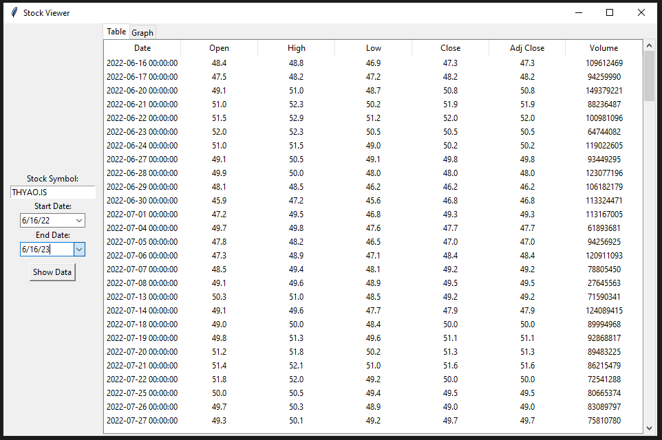

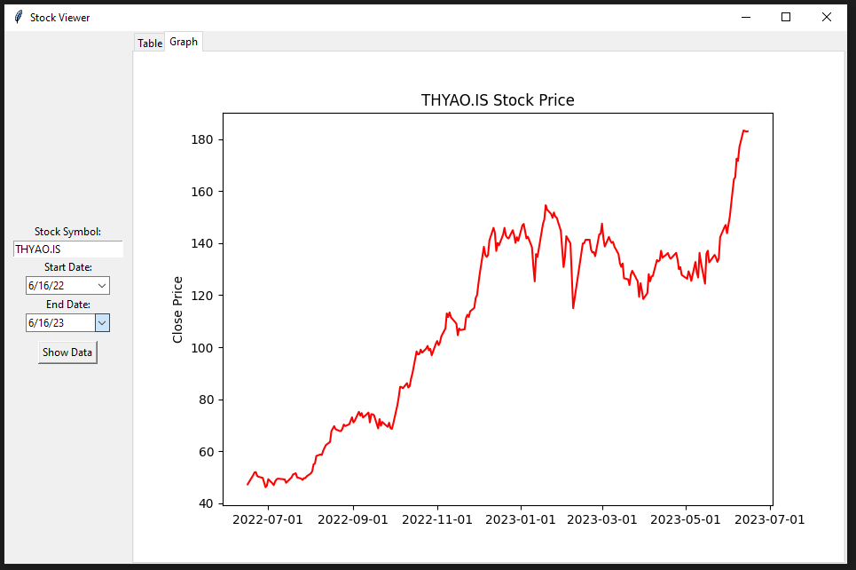

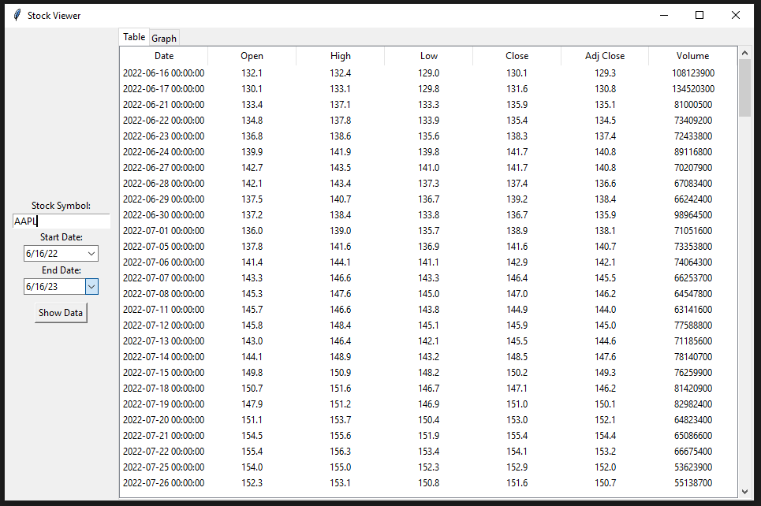

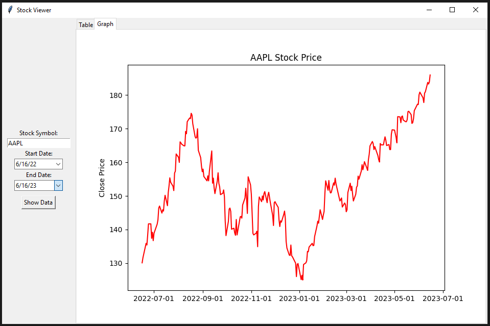

Kullanıcı verileri indirmek isteyebilir. Bu durumda bir tane buton ve fonksiyon tanımlayalım.

Butonu "Show Data" butonunun altına ekleyelim. Fonksiyonu pass ile geçelim.

```python
import tkinter as tk
from tkinter import ttk
from tkcalendar import DateEntry
from tkinter import messagebox
import yfinance as yf
import pandas as pd
import matplotlib.pyplot as plt
from matplotlib.backends.backend_tkagg import FigureCanvasTkAgg
import matplotlib.dates as mdates

window = tk.Tk()
window.title("Stock Viewer")
window.geometry("950x600")

def show_data():
    # Verileri oku
    symbol = entry_symbol.get()
    start_date = calendar_start.get_date()
    end_date = calendar_end.get_date()
    try:
        # Hisse senedi verilerini al
        data = yf.download(symbol, start=start_date, end=end_date)
        df = pd.DataFrame(data)

        # Tarih sütununu ekle ve formatı çevir
        df.reset_index(inplace=True)
        df["Date"] = pd.to_datetime(df["Date"])

        # Satırları sayısal değerlere dönüştür ve yuvarla
        df[["Open", "High", "Low", "Close", "Adj Close"]] = df[["Open", "High", "Low", "Close", "Adj Close"]].round(1).astype(float)
        df[["Volume"]] = df[["Volume"]].astype(int)

        # Başka bir sembol girildiğinde tabloyu temizle
        table.delete(*table.get_children())

        # Tabloya verileri yerleştir
        table["columns"] = list(df.columns)
        for column in list(df.columns):
            table.column(column, width=100, anchor="center")
            table.heading(column, text=column, anchor="center")
        for index, row in df.iterrows():
            table.insert("", "end", values=list(row))

        # Grafik oluştur
        fig, ax = plt.subplots(figsize=(8, 6))
        ax.xaxis.set_major_formatter(mdates.DateFormatter("%Y-%m-%d"))
        ax.xaxis.set_major_locator(mdates.AutoDateLocator())
        ax.plot(df["Date"], df["Close"], linestyle="-", color="red")
        ax.set_xlabel("")
        ax.set_ylabel("Close Price")
        ax.set_title(f"{symbol} Stock Price")

        # Grafik üzerindeki verileri göstermek için Canvas kullan
        canvas = FigureCanvasTkAgg(fig, master=tab_graph)
        canvas.draw()
        canvas.get_tk_widget().pack()

        # Eğer daha önce bir grafik eklenmişse önceki grafiği temizle
        for widget in tab_graph.winfo_children():
            widget.destroy()

        # Yeni grafik widget'ını ekle
        canvas = FigureCanvasTkAgg(fig, master=tab_graph)
        canvas.draw()
        canvas.get_tk_widget().pack()

    except Exception as e:
        messagebox.showerror("Error", str(e))

def export_data():
    pass

frame_left = tk.Frame(window)
frame_left.pack(side="left", padx=10, pady=10)

label_symbol = tk.Label(frame_left, text="Stock Symbol:")
label_symbol.pack()

entry_symbol = tk.Entry(frame_left)
entry_symbol.pack()

date_start = tk.Label(frame_left, text="Start Date:")
date_start.pack()
calendar_start = DateEntry(frame_left, width=12, background="darkblue", foreground="white", borderwidth=2)
calendar_start.pack()

date_end = tk.Label(frame_left, text="End Date:")
date_end.pack()
calendar_end = DateEntry(frame_left, width=12, background="darkblue", foreground="white", borderwidth=2)
calendar_end.pack()

button_show = tk.Button(frame_left, text="Show Data", command=show_data)
button_show.pack(pady=10)

button_export = tk.Button(frame_left, text="Export Data", command=export_data)
button_export.pack(pady=10)

tab_control = ttk.Notebook(window)
tab_table = ttk.Frame(tab_control)
tab_control.add(tab_table, text="Table")

tab_graph = ttk.Frame(tab_control)
tab_control.add(tab_graph, text="Graph")

tab_control.pack(expand=1, fill="both")

table = ttk.Treeview(tab_table)
table.grid(row=0, column=0, sticky="nsew")

scrollbar = ttk.Scrollbar(tab_table, orient="vertical", command=table.yview)
scrollbar.grid(row=0, column=1, sticky="ns")

table.configure(yscrollcommand=scrollbar.set)
table["show"] = "headings"

tab_table.grid_columnconfigure(0, weight=1)
tab_table.grid_rowconfigure(0, weight=1)

window.mainloop()
```

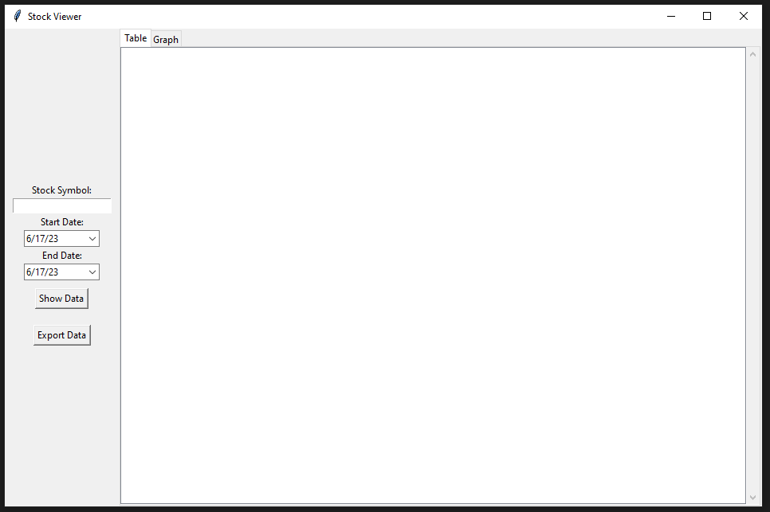

Verileri indirecek fonksiyonu yazalım.

```python
import tkinter as tk
from tkinter import ttk
from tkcalendar import DateEntry
from tkinter import messagebox
from tkinter import filedialog
import yfinance as yf
import pandas as pd
import matplotlib.pyplot as plt
from matplotlib.backends.backend_tkagg import FigureCanvasTkAgg
import matplotlib.dates as mdates

window = tk.Tk()
window.title("Stock Viewer")
window.geometry("950x600")

def show_data():
    # Verileri oku
    symbol = entry_symbol.get()
    start_date = calendar_start.get_date()
    end_date = calendar_end.get_date()
    try:
        # Hisse senedi verilerini al
        data = yf.download(symbol, start=start_date, end=end_date)
        df = pd.DataFrame(data)

        # Tarih sütununu ekle ve formatı çevir
        df.reset_index(inplace=True)
        df["Date"] = pd.to_datetime(df["Date"])

        # Satırları sayısal değerlere dönüştür ve yuvarla
        df[["Open", "High", "Low", "Close", "Adj Close"]] = df[["Open", "High", "Low", "Close", "Adj Close"]].round(1).astype(float)
        df[["Volume"]] = df[["Volume"]].astype(int)

        # Başka bir sembol girildiğinde tabloyu temizle
        table.delete(*table.get_children())

        # Tabloya verileri yerleştir
        table["columns"] = list(df.columns)
        for column in list(df.columns):
            table.column(column, width=100, anchor="center")
            table.heading(column, text=column, anchor="center")
        for index, row in df.iterrows():
            table.insert("", "end", values=list(row))

        # Grafik oluştur
        fig, ax = plt.subplots(figsize=(8, 6))
        ax.xaxis.set_major_formatter(mdates.DateFormatter("%Y-%m-%d"))
        ax.xaxis.set_major_locator(mdates.AutoDateLocator())
        ax.plot(df["Date"], df["Close"], linestyle="-", color="red")
        ax.set_xlabel("")
        ax.set_ylabel("Close Price")
        ax.set_title(f"{symbol} Stock Price")

        # Grafik üzerindeki verileri göstermek için Canvas kullan
        canvas = FigureCanvasTkAgg(fig, master=tab_graph)
        canvas.draw()
        canvas.get_tk_widget().pack()

        # Eğer daha önce bir grafik eklenmişse önceki grafiği temizle
        for widget in tab_graph.winfo_children():
            widget.destroy()

        # Yeni grafik widget'ını ekle
        canvas = FigureCanvasTkAgg(fig, master=tab_graph)
        canvas.draw()
        canvas.get_tk_widget().pack()

    except Exception as e:
        messagebox.showerror("Error", str(e))

def export_data():
    symbol = entry_symbol.get()
    start_date = calendar_start.get_date()
    end_date = calendar_end.get_date()
    try:
        data = yf.download(symbol, start=start_date, end=end_date)
        df = pd.DataFrame(data)
        df.reset_index(inplace=True)
        df["Date"] = pd.to_datetime(df["Date"])

        # Dosya kaydetme iletişim kutusunu aç
        file_path = filedialog.asksaveasfilename(defaultextension=".xlsx")
        if file_path:
            # Verileri Excel dosyasına yaz
            df.to_excel(file_path, index=False)
            messagebox.showinfo("Success", "Data exported successfully!")
        else:
            messagebox.showwarning("Warning", "No file selected.")

    except Exception as e:
        messagebox.showerror("Error", str(e))

frame_left = tk.Frame(window)
frame_left.pack(side="left", padx=10, pady=10)

label_symbol = tk.Label(frame_left, text="Stock Symbol:")
label_symbol.pack()

entry_symbol = tk.Entry(frame_left)
entry_symbol.pack()

date_start = tk.Label(frame_left, text="Start Date:")
date_start.pack()
calendar_start = DateEntry(frame_left, width=12, background="darkblue", foreground="white", borderwidth=2)
calendar_start.pack()

date_end = tk.Label(frame_left, text="End Date:")
date_end.pack()
calendar_end = DateEntry(frame_left, width=12, background="darkblue", foreground="white", borderwidth=2)
calendar_end.pack()

button_show = tk.Button(frame_left, text="Show Data", command=show_data)
button_show.pack(pady=10)

button_export = tk.Button(frame_left, text="Export Data", command=export_data)
button_export.pack(pady=10)

tab_control = ttk.Notebook(window)
tab_table = ttk.Frame(tab_control)
tab_control.add(tab_table, text="Table")

tab_graph = ttk.Frame(tab_control)
tab_control.add(tab_graph, text="Graph")

tab_control.pack(expand=1, fill="both")

table = ttk.Treeview(tab_table)
table.grid(row=0, column=0, sticky="nsew")

scrollbar = ttk.Scrollbar(tab_table, orient="vertical", command=table.yview)
scrollbar.grid(row=0, column=1, sticky="ns")

table.configure(yscrollcommand=scrollbar.set)
table["show"] = "headings"

tab_table.grid_columnconfigure(0, weight=1)
tab_table.grid_rowconfigure(0, weight=1)

window.mainloop()
```

**Debug sonucu `data = yf.download(symbol, start=start_date, end=end_date)` satırının lokalde çalışmasına rağmen .exe dönüşümünden sonra problem yarattığını gördüm. Bu nedenle, İş Yatırım'ı baz alarak kodu güncelliyorum.**

```python
# import logging
import tkinter as tk
from tkinter import ttk
from tkcalendar import DateEntry
from tkinter import messagebox
from tkinter import filedialog
import pandas as pd
import requests
import json
import matplotlib.pyplot as plt
from matplotlib.backends.backend_tkagg import FigureCanvasTkAgg
import matplotlib.dates as mdates
import babel.numbers

# logging.basicConfig(filename='debug.log', level=logging.DEBUG)

window = tk.Tk()
window.title("Stock Viewer")
window.geometry("950x600")

def show_data():
    # Verileri oku
    symbol = entry_symbol.get()
    start_date = calendar_start.get_date().strftime("%d-%m-%Y")
    end_date = calendar_end.get_date().strftime("%d-%m-%Y")
    try:
        # Hisse senedi verilerini al
        my_url = "https://www.isyatirim.com.tr/_layouts/15/Isyatirim.Website/Common/Data.aspx/HisseTekil?"
        my_url += "hisse={}&startdate={}&enddate={}.json".format(symbol, start_date, end_date)

        result = json.loads(requests.get(my_url).text)

        df = (
            pd.DataFrame(result['value'])
            .loc[:, ['HGDG_TARIH', 'HGDG_KAPANIS', 'DOLAR_BAZLI_FIYAT']]
            .rename(columns={'HGDG_TARIH': 'Date', 'HGDG_KAPANIS': 'Close', 'DOLAR_BAZLI_FIYAT': 'Dollar-Based'})
        )

        df['Date'] = pd.to_datetime(df['Date'], format='%d-%m-%Y').dt.strftime('%Y-%m-%d')

        # Başka bir sembol girildiğinde tabloyu temizle
        table.delete(*table.get_children())

        # Tabloya verileri yerleştir
        table["columns"] = list(df.columns)
        for column in list(df.columns):
            table.column(column, width=100, anchor="center")
            table.heading(column, text=column, anchor="center")
        for index, row in df.iterrows():
            table.insert("", "end", values=list(row))

        # Grafik oluştur
        fig, ax = plt.subplots(figsize=(8, 6))
        ax.xaxis.set_major_formatter(mdates.DateFormatter("%Y-%m-%d"))
        ax.xaxis.set_major_locator(mdates.AutoDateLocator())
        if radio_var.get() == "TRY":
            ax.plot(pd.to_datetime(df["Date"], format='%Y-%m-%d'), df["Close"], linestyle="-", color="red")
        elif radio_var.get() == "USD":
            ax.plot(pd.to_datetime(df["Date"], format='%Y-%m-%d'), df["Dollar-Based"], linestyle="-", color="blue")
        ax.set_xlabel("")
        ax.set_ylabel("Close Price")
        ax.set_title(f"{symbol} Stock Price ({radio_var.get()})")

        # Grafik üzerindeki verileri göstermek için Canvas kullan
        canvas = FigureCanvasTkAgg(fig, master=tab_graph)
        canvas.draw()
        canvas.get_tk_widget().pack()

        # Eğer daha önce bir grafik eklenmişse önceki grafiği temizle
        for widget in tab_graph.winfo_children():
            widget.destroy()

        # Yeni grafik widget'ını ekle
        canvas = FigureCanvasTkAgg(fig, master=tab_graph)
        canvas.draw()
        canvas.get_tk_widget().pack()

    except Exception as e:
        # logging.exception("Error: ")
        messagebox.showerror("Error", str(e))

def export_data():
    symbol = entry_symbol.get()
    start_date = calendar_start.get_date().strftime("%d-%m-%Y")
    end_date = calendar_end.get_date().strftime("%d-%m-%Y")
    try:
        my_url = "https://www.isyatirim.com.tr/_layouts/15/Isyatirim.Website/Common/Data.aspx/HisseTekil?"
        my_url += "hisse={}&startdate={}&enddate={}.json".format(symbol, start_date, end_date)

        result = json.loads(requests.get(my_url).text)

        df = (
            pd.DataFrame(result['value'])
            .loc[:, ['HGDG_TARIH', 'HGDG_KAPANIS', 'DOLAR_BAZLI_FIYAT']]
            .rename(columns={'HGDG_TARIH': 'Date', 'HGDG_KAPANIS': 'Close', 'DOLAR_BAZLI_FIYAT': 'Dollar-Based'})
        )

        df['Date'] = pd.to_datetime(df['Date'], format='%d-%m-%Y').dt.strftime('%Y-%m-%d')

        # Dosya kaydetme iletişim kutusunu aç
        file_path = filedialog.asksaveasfilename(defaultextension=".xlsx")
        if file_path:
            # Verileri Excel dosyasına yaz
            df.to_excel(file_path, index=False)
            messagebox.showinfo("Success", "Data exported successfully!")
        else:
            messagebox.showwarning("Warning", "No file selected.")

    except Exception as e:
        messagebox.showerror("Error", str(e))

frame_left = tk.Frame(window)
frame_left.pack(side="left", padx=10, pady=10)

label_symbol = tk.Label(frame_left, text="Stock Symbol:")
label_symbol.pack()

entry_symbol = tk.Entry(frame_left)
entry_symbol.pack()

date_start = tk.Label(frame_left, text="Start Date:")
date_start.pack()
calendar_start = DateEntry(frame_left, width=12, background="darkblue", foreground="white", borderwidth=2)
calendar_start.pack()

date_end = tk.Label(frame_left, text="End Date:")
date_end.pack()
calendar_end = DateEntry(frame_left, width=12, background="darkblue", foreground="white", borderwidth=2)
calendar_end.pack()

frame_radio = tk.Frame(frame_left)
frame_radio.pack(pady=10)
radio_var = tk.StringVar(value="TRY")
radio_try = tk.Radiobutton(frame_radio, text="TRY", variable=radio_var, value="TRY")
radio_try.pack(side="left")
radio_usd = tk.Radiobutton(frame_radio, text="USD", variable=radio_var, value="USD")
radio_usd.pack(side="left")

button_show = tk.Button(frame_left, text="Show Data", command=show_data)
button_show.pack(pady=10)

button_export = tk.Button(frame_left, text="Export Data", command=export_data)
button_export.pack(pady=10)

tab_control = ttk.Notebook(window)
tab_table = ttk.Frame(tab_control)
tab_control.add(tab_table, text="Table")

tab_graph = ttk.Frame(tab_control)
tab_control.add(tab_graph, text="Graph")

tab_control.pack(expand=1, fill="both")

table = ttk.Treeview(tab_table)
table.grid(row=0, column=0, sticky="nsew")

scrollbar = ttk.Scrollbar(tab_table, orient="vertical", command=table.yview)
scrollbar.grid(row=0, column=1, sticky="ns")

table.configure(yscrollcommand=scrollbar.set)
table["show"] = "headings"

tab_table.grid_columnconfigure(0, weight=1)
tab_table.grid_rowconfigure(0, weight=1)

window.mainloop()
```

# 4. Tkinter Uygulamasını exe Dosyasına Dönüştürme

---

Tkinter ile oluşturduğumuz uygulamayı .exe dosyasına dönüştüreceğiz.

.exe, Windows işletim sisteminde çalıştırılabilir bir dosya türüdür. Bu dosyalar, bir programın veya uygulamanın tamamlanmış ve derlenmiş halini temsil eder.

Dönüştürme işlemi için pyinstaller isimli bir Python paketinden yararlanabiliriz. Bu paket, Python programlarını platforma özgü yürütülebilir dosyalara dönüştüren bir Python paketidir. Tkinter gibi GUI kütüphaneleriyle birlikte kullanılarak Python uygulamalarının bağımsız çalıştırılabilir dosyalara dönüştürülmesini sağlar.

* Adım 1:

pyinstaller'ın kurulumu için aşağıdaki komutu kullanabiliriz.

```
pip install pyinstaller
```

* Adım 2:

Kodların bulunduğu dosyanın ismini `main.py` yapıyoruz (tercih) ve bir ikon ile beraber (opsiyonel) bir dosyanın içerisine koyuyoruz. İkonun .ico uzantılı olması gerekiyor. İnternette, .ico formatına çevirebilecek birçok site bulunmaktadır.

* Adım 3:

VS Code'dan (ya da istediğiniz bir ortamdan ilerleyebilirsiniz) terminale gidiyoruz ve daha önce oluşturduğumuz dosyanın içerisine giriyoruz.

Benim bir alt dosyaya inmem gerektiği için aşağıdaki komutu çalıştırıyorum.

```
cd ./stock_viewer
```

Artık .exe dosyasına dönüşümü sağlayacak komutu çalıştırabiliriz.

```
pyinstaller --onefile --windowed --icon=stock.ico main.py
```

`--onefile`: Derlenmiş uygulamanın tek bir .exe dosyası olarak oluşturulmasını sağlar. Bu şekilde, uygulamanın tüm kaynak dosyaları ve bağımlılıkları tek bir dosyada birleştirilir.

`--windowed`: Uygulamanın siyah bir komut istemi ekranı yerine doğrudan bir pencere olarak açılmasını sağlar. Böylece kullanıcılar, uygulamayı çalıştırdıklarında arayüzü görürler.

`--icon=stock.ico`: Bu parametre, uygulamanın kullanacağı ikonu belirtir. `stock.ico` dosyası, uygulamanın simgesini temsil eder. İkon dosyasını, uygulamanın .exe dosyasıyla aynı dizine yerleştirmemiz gerekmektedir.

Komutu çalıştırdıktan sonra, pyinstaller uygulamamızı analiz edecek ve bir `dist` isimli bir klasör oluşturarak derlenmiş dosyaları içine yerleştirecektir. .exe dosyamız bu klasörde bulunacaktır.

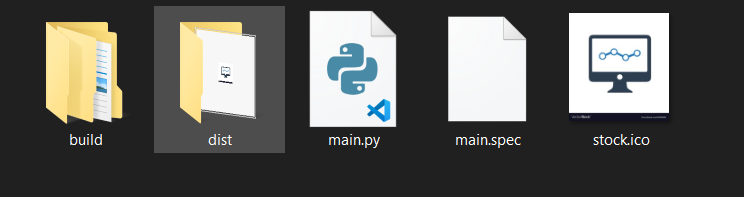